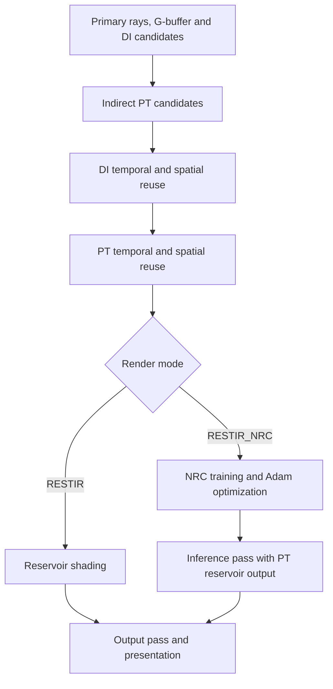

# VulkanLearn2

**An experimental Vulkan renderer for ReSTIR direct illumination, global illumination, and path tracing.**

English | [Русский](README.ru.md)

VulkanLearn2 is a C++20 rendering playground for exploring reservoir resampling and lighting at low sample counts. It includes a reference path tracer with next event estimation (NEE), a ReSTIR DI + PT pipeline, emissive triangle lights, and an experimental Neural Radiance Cache (NRC). The current rendering paths use Slang shaders alongside the project's GLSL implementations.


*An existing project capture: ReSTIR PT at 1 sample per pixel (spp), without frame accumulation. ReSTIR still reuses reservoirs across frames; this is separate from averaging rendered frames.*

[Features](#features) · [Build](#build) · [Run and configure](#run-and-configure) · [Controls](#controls) · [Gallery](#gallery) · [Code map](#code-map)

## Features

### Rendering and lighting

- **ReSTIR DI:** light candidate generation with resampled importance sampling (RIS), followed by temporal and spatial reservoir reuse for direct illumination.
- **ReSTIR PT:** indirect path candidates, temporal reuse, and spatial path reconnection with Jacobian weighting. The active `RESTIR` mode combines DI and PT.
- **Reference path tracer:** NEE with RIS light selection, diffuse/specular BRDF sampling, emissive surfaces, shadow rays, and Russian roulette termination.
- **Many-light sampling:** directional sunlight, point lights, and textured emissive triangles. Light flux is evaluated on the GPU; a spatial grid and per-cell alias tables guide light selection in the ReSTIR shaders.
- **PBR materials:** base color, metalness, roughness, normal maps, emission, and opacity handling in any-hit shaders. The shared BRDF code defaults to GGX microfacet specular and Frostbite diffuse.
- **Scene loading:** Assimp-based import, with OBJ, glTF, and FBX scene configurations; scene transforms, camera placement, and lighting are configured through XML.
- **Interactive inspection:** an SDL2 camera, Dear ImGui controls for indirect path depth and sunlight, and a statistics/log window with CPU/GPU frame timings.

### Experimental and inactive paths

The repository also contains work that is not enabled in the current rendering loop:

| Component | Current state |
| --- | --- |
| Neural Radiance Cache | `RESTIR_NRC` runs training, Adam optimization, and an inference pass using Slang cooperative vectors. The output shader currently takes indirect radiance from the PT reservoir; the network prediction is not yet used for the displayed result. |
| Separate ReSTIR GI passes | GI temporal and spatial reuse implementations are present; their draw calls are disabled in the active DI + PT pipeline. |
| NVIDIA NRD | Denoiser integration and HLSL shader build support are present. Denoiser initialization and dispatch are commented out. |
| Frame accumulation | The accumulation pass and reset logic exist, but `shaders/accumulate.frag` currently forwards the current frame instead of averaging history. |
| Raster G-buffer / visibility buffer | Mesh/task shader pipelines, meshlet processing, and depth-pyramid culling code are present. `GBUFFER_ON` and `VBUFFER_ON` default to `0`. |
| HDR / image-based lighting | Environment, irradiance, and prefiltered cubemap generation code exists. IBL initialization is disabled; the active path tracers use a black background on a miss. |
| Streamline | SDK files and wrapper code are present; `STREAMLINE_ON` defaults to `0`. DLSS is not an active rendering feature. |

This is a research and learning project. The gallery illustrates existing experiments; it is not a benchmark or a guarantee of identical output from the current revision.

## Build

### Requirements

The current build targets **Windows x64**. It uses bundled Windows SDL2 libraries, a Streamline import library, Win32 Vulkan definitions, and `.exe` shader compilers.

- **Visual Studio 2022** with Desktop development with C++ and a Windows SDK, including FXC for NRD's default shader build.
- **CMake** with the `Visual Studio 17 2022` generator (3.21 or newer).
- **Vulkan SDK** with Vulkan 1.4 headers, `glslc.exe`, `slangc.exe`, and a SPIR-V-capable `dxc.exe`. Slang must support `spvCooperativeVectorNV`. The existing local build configuration uses SDK **1.4.309.0**; this is a configuration reference, not a tested minimum version.
- **A compatible NVIDIA GPU and driver.** Device creation requires Vulkan 1.4 plus NVIDIA-specific mesh shader and cooperative vector extensions. Ray tracing support alone is insufficient.

The device requirements in [vk_engine.cpp](src/vk_engine.cpp) include `VK_KHR_ray_tracing_pipeline`, `VK_KHR_acceleration_structure`, `VK_KHR_ray_query`, `VK_NV_mesh_shader`, `VK_NV_cooperative_vector`, and `VK_EXT_shader_replicated_composites`, along with descriptor indexing and buffer device addresses. **Cooperative vector support is requested in every render mode**, including `PATHTRACER` and `RESTIR`.

Dependencies are stored under `third_party/`, including SDL2, GLM, volk, vk-bootstrap, VMA, Assimp, Dear ImGui, meshoptimizer, SPIRV-Reflect, NRD, and Streamline. Keep these directories when cloning or copying the project.

### Configure and compile

Run these commands in PowerShell. Set `VULKAN_SDK` to your installed SDK directory if the installer has not already configured it. The explicit compiler paths below avoid relying on CMake's shader compiler search paths; adjust them if your SDK layout differs.

```powershell
git clone https://github.com/collateraris/VulkanLearn2.git
Set-Location VulkanLearn2

cmake -S . -B build -G "Visual Studio 17 2022" -A x64 `
  "-DGLSLC:FILEPATH=$env:VULKAN_SDK/Bin/glslc.exe" `
  "-DSLANG:FILEPATH=$env:VULKAN_SDK/Bin/slangc.exe" `
  "-DDXC:FILEPATH=$env:VULKAN_SDK/Bin/dxc.exe" `
  -DASSIMP_BUILD_ZLIB=ON

cmake --build build --config Release --target vulkan_guide --parallel
```

The executable target is named **`vulkan_guide`**. With this generator, the executable is written to `bin/Release/vulkan_guide.exe`. Use a fresh build directory if an existing `build/` cache was configured with another generator.

The executable depends on the `Shaders` target, which compiles GLSL, Slang, and NRD HLSL sources to SPIR-V beside their source files. NRD also builds its own shader containers, so the first build can involve substantial shader compilation.

### Runtime libraries

Place SDL2 and the matching Release Assimp/NRD DLLs beside the executable. From the repository root, for the build above:

```powershell
Copy-Item .\third_party\SDL2-2.28.2\lib\x64\SDL2.dll .\bin\Release\
Copy-Item .\third_party\streamline\bin\x64\sl.interposer.dll .\bin\Release\

Get-ChildItem .\build\third_party -Recurse -File -Include 'assimp-*.dll', 'NRD.dll' |
  Where-Object { $_.Directory.Name -eq 'Release' } |
  Copy-Item -Destination .\bin\Release\
```

Use DLLs from the same build configuration as the executable. For a Debug build, the output folder and library names can differ. CMake still links NRD and the Streamline import library even though their rendering integrations are inactive.

## Run and configure

### First launch

Edit [assets/config.xml](assets/config.xml) before launching. To start with the included Sponza scene, replace the existing `current_scene` and `render_mode` elements with:

```xml
<current_scene id="1"></current_scene>
<render_mode name="RESTIR"></render_mode>
```

Then launch **with `bin/Release` as the working directory**:

```powershell
Set-Location .\bin\Release
.\vulkan_guide.exe
```

Runtime paths such as `../../assets/`, `../../shaders/`, and `../../shaders_slang/` are relative to the **process working directory**, not the executable location. Visual Studio's debugger working directory is configured to use the executable directory. Launching from the repository root will resolve these paths incorrectly.

### Render modes

| `render_mode name` | Behavior |
| --- | --- |
| `RESTIR` | ReSTIR DI + PT with temporal and spatial reuse, followed by reservoir shading. |
| `PATHTRACER` | Reference path tracing with NEE and RIS light selection. |
| `RESTIR_NRC` | ReSTIR with experimental NRC training, optimization, and inference passes; displayed indirect lighting still comes from PT reservoirs. |

Mode and scene settings are read at startup. Restart the application after changing the XML. There are no command-line scene or rendering options.

### Scene presets

| Index | Model path relative to `assets/` | Asset availability |
| --- | --- | --- |
| `0` | `builder/scene.gltf` | Included: Atlanta office building. |
| `1` | `sponza.obj` | Included: Sponza. |
| `2` | `lost_empire.obj` | Included: Lost Empire. |
| `3` | `r46_subway/scene.gltf` | External asset; not tracked in the repository. |
| `4` | `Bistro_v5_2/BistroExterior.fbx` | External asset; not tracked in the repository. |
| `5` | `Bistro_v5_2/BistroInterior.fbx` | External asset; not tracked in the repository. |

The loader treats `current_scene.id` as a **zero-based position** in the `<scene_configs>` list, rather than looking up a scene's `id` attribute. Keep preset order and indices aligned when adding scenes. External scenes require their model files and referenced textures in the configured locations.

The XML also controls window title/resolution, scene scale and rotation, sunlight, an optional uniform point-light grid, and initial camera position/orientation. Model `radians` values are converted from degrees by the loader despite the attribute name; `camPitch` and `camYaw` are used directly as radians. HDR paths and cubemap sizes are retained for the inactive IBL path.

## Controls

Camera input is active on startup. Press **`M`** to suspend camera input while using the UI, then press it again to resume.

| Input | Action |
| --- | --- |
| Mouse | Look around while camera input is active. |
| `W` / `S` or Up / Down | Move forward / backward. |
| `A` / `D` or Left / Right | Strafe left / right. |
| `R` / `F` | Move up / down. |
| Left Shift | Move faster while held. |
| `Q` / `E` | Adjust yaw. |
| `Z` / `X` | Adjust pitch. |
| `M` | Toggle camera input for UI interaction. |
| Close window / Alt+F4 | Exit. |

In **Edit GI**, `Indirect numRays` controls the indirect bounce limit; it is not a samples-per-pixel setting. The UI starts this value at `0`, so increase it to explore indirect illumination. The same panel lets you edit camera position/rotation and, when enabled for the scene, the sun direction and color.

## Rendering flow

The active ReSTIR pipeline is assembled in [vk_gi_raytrace_graphics_pipeline.cpp](src/graphic_pipeline/vk_gi_raytrace_graphics_pipeline.cpp):



Primary-hit material and geometry data are generated by ray tracing in this path. The output pass currently performs no frame averaging, and NRD is not dispatched.

## Gallery

### Reference path tracer vs. ReSTIR PT

Existing Bistro interior captures at **1 spp without frame accumulation**, with emissive triangle lighting. The original README describes the reference renderer as based on *Ray Tracing Gems II*, extended with emissive triangle and NEE RIS support.

| Reference path tracer with NEE | ReSTIR PT |
| --- | --- |
|  |  |
|  |  |

<details>
<summary>More ReSTIR PT captures</summary>


</details>

## Code map

| Path | Purpose |
| --- | --- |
| [src/vk_engine.cpp](src/vk_engine.cpp) | Vulkan/device setup, scene initialization, frame loop, and mode selection. |
| [src/graphic_pipeline/](src/graphic_pipeline/) | ReSTIR, reference tracing, NRC, denoising, and presentation passes. |
| [src/vk_light_manager.cpp](src/vk_light_manager.cpp) | Scene lights, spatial light grid, and alias tables. |
| [src/vk_assimp_loader.cpp](src/vk_assimp_loader.cpp) | Model, material, and texture import. |
| [src/neural_shading/](src/neural_shading/) | NRC network layout, parameters, and cooperative vector utilities. |
| [shaders_slang/](shaders_slang/) | Active DI/PT shaders, BRDF code, NRC training/optimizer/inference, and neural shading helpers. |
| [shaders/](shaders/) | GLSL implementations, raster/mesh shaders, accumulation, and IBL passes. |
| [src/sys_config/](src/sys_config/) | XML parsing and resource path definitions. |
| [assets/](assets/) | Configuration, included scenes, textures, and asset credits. |
| [third_party/](third_party/) | Bundled libraries, SDK integrations, and shader compiler binaries. |
| [img/](img/) | Project screenshots. |

## Troubleshooting

- **CMake cannot find a shader compiler:** check `VULKAN_SDK` and the `GLSLC`, `SLANG`, and `DXC` cache entries. A `slangc.exe` that lacks cooperative vector support cannot compile the current shader target.
- **NRD shader tools fail to configure:** verify that the Windows SDK includes FXC/DXC. NRD's own ShaderMake configuration also searches for these tools; it is separate from the top-level `DXC` variable.
- **A DLL is missing at startup:** copy the matching SDL2, Assimp, and NRD runtime libraries beside the executable as described above.
- **Configuration, models, or shaders cannot be loaded:** check the working directory and the selected scene. Subway and Bistro presets refer to assets that are not included in a fresh clone.
- **No suitable GPU / device creation fails:** compare the GPU's supported features and extensions with `init_vulkan()` in `src/vk_engine.cpp`. Disabling NRC in XML does not remove the cooperative vector requirement.
- **Indirect lighting is missing:** increase `Indirect numRays` above `0`. A black background is expected with the currently inactive environment-lighting path.
- **Shader header edits do not appear:** shader build rules depend on entry-point files, not all included headers. Update the timestamp of the affected entry-point files and rebuild `Shaders`; rebuild the executable as well when changing shared CPU/GPU layouts.

## Development direction

The original goals remain the focus of the project: improve the shading model and ReSTIR implementation, develop NRC acceleration, and add denoising. NRC and denoiser infrastructure now exist; using network predictions in the final image and enabling a working denoising path remain further work.

## Credits

- The renderer retains the `vulkan_guide` target and Vulkan Guide-based project structure.
- The BRDF implementation credits Jakub Boksansky's *Crash Course in BRDF Implementation*; attribution is preserved in [shaders_slang/brdf.h](shaders_slang/brdf.h).
- Sponza was created by Frank Meinl; see [assets/README.md](assets/README.md).
- Lost Empire comes from the Vokselia Minecraft world and was converted to OBJ by Morgan McGuire using Mineways; see [assets/copyright.txt](assets/copyright.txt).
- The Atlanta office building is by 99.Miles, under CC BY 4.0; see [assets/builder/license.txt](assets/builder/license.txt).
- Bundled dependencies retain their own license files under `third_party/`. External scene assets retain their respective authors' terms.
