# VulkanLearn2

**An experimental bindless Vulkan renderer for ReSTIR direct illumination, global illumination, and path tracing.**

English | [Русский](README.ru.md)

VulkanLearn2 is a C++20 rendering playground for exploring reservoir resampling and lighting at low sample counts. It includes a reference path tracer with next event estimation (NEE), a ReSTIR DI + PT pipeline, emissive triangle lights, and an experimental Neural Radiance Cache (NRC). The current rendering paths use Slang shaders alongside the project's GLSL implementations.

[Features](#features) · [Architecture](#render-graph-rhi-and-vulkan) · [Build](#build) · [Run and configure](#run-and-configure) · [Controls](#controls) · [Rendering flow](#rendering-flow) · [Gallery](#gallery) · [Code map](#code-map)

## Gallery

**[Watch the renderer in motion on YouTube](https://www.youtube.com/watch?v=Q_fKG3UT02U)**

Fifteen captures of the current **ReSTIR DI + PT** renderer, without NRC: **1200 × 800**, frame **512**, across four scenes and five views. The first column shows one unaveraged frame after reservoir warmup; the other columns average **512 frames**, with the denoiser added in the last column.

**Scene 1 — Sponza**

| No frame accumulation | Frame accumulation | Frame accumulation + denoiser |
| --- | --- | --- |
| 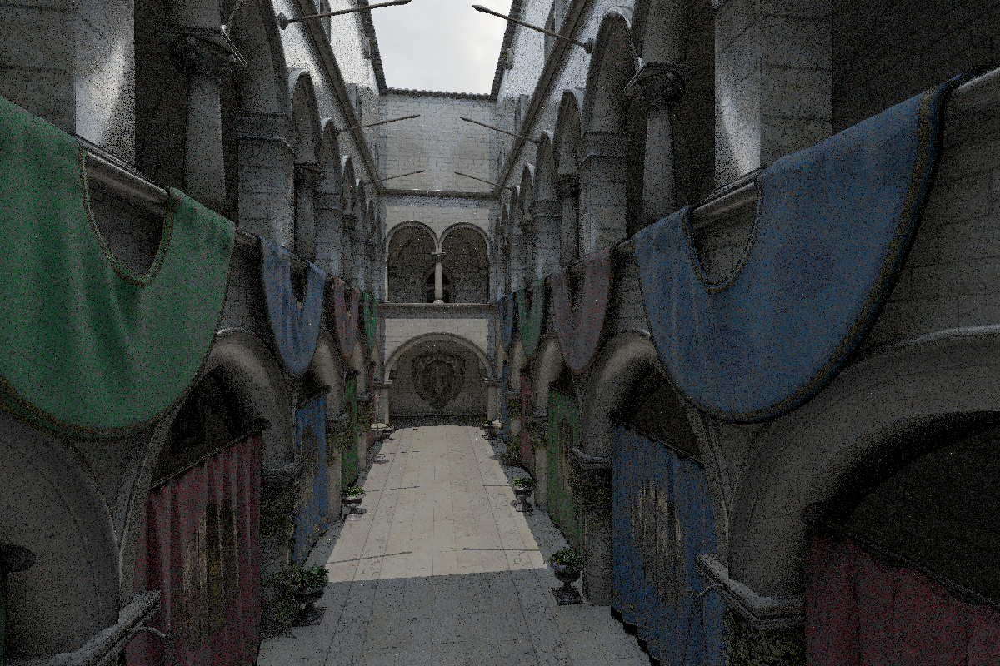 | 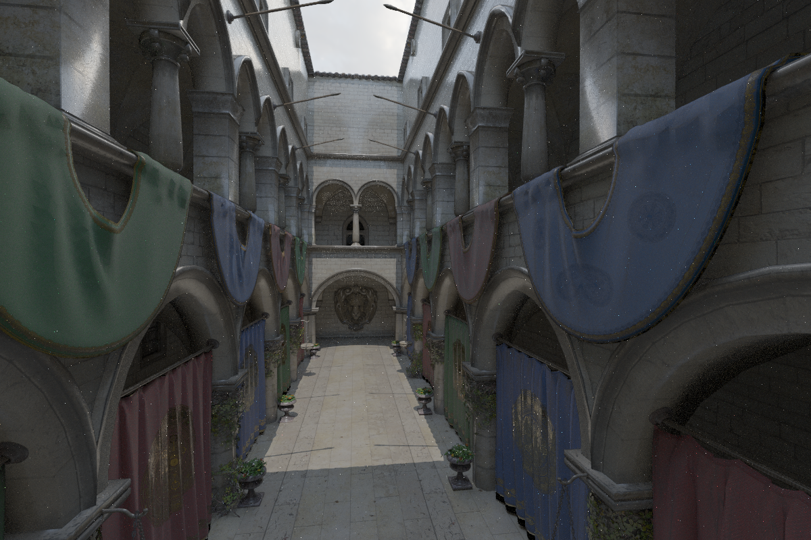 |  |

**Scene 2 — Lost Empire, View 1**

| No frame accumulation | Frame accumulation | Frame accumulation + denoiser |
| --- | --- | --- |
| 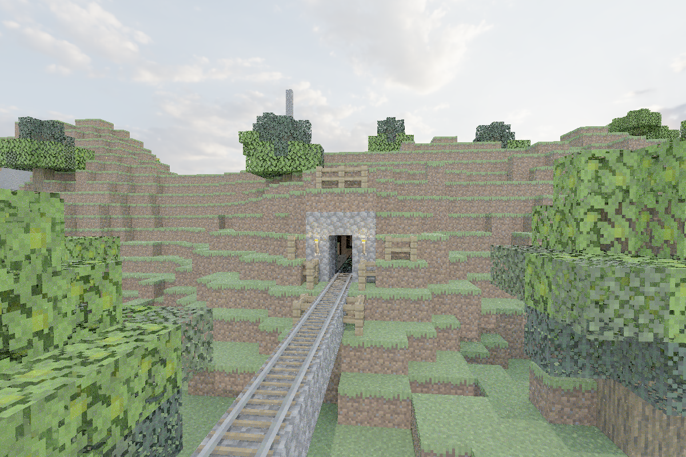 | 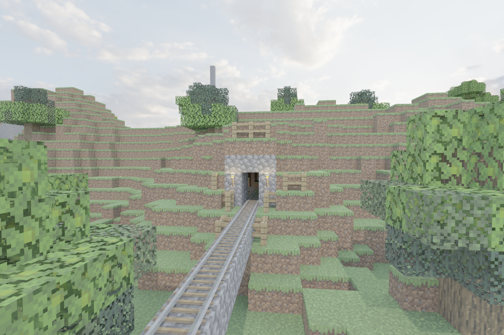 | 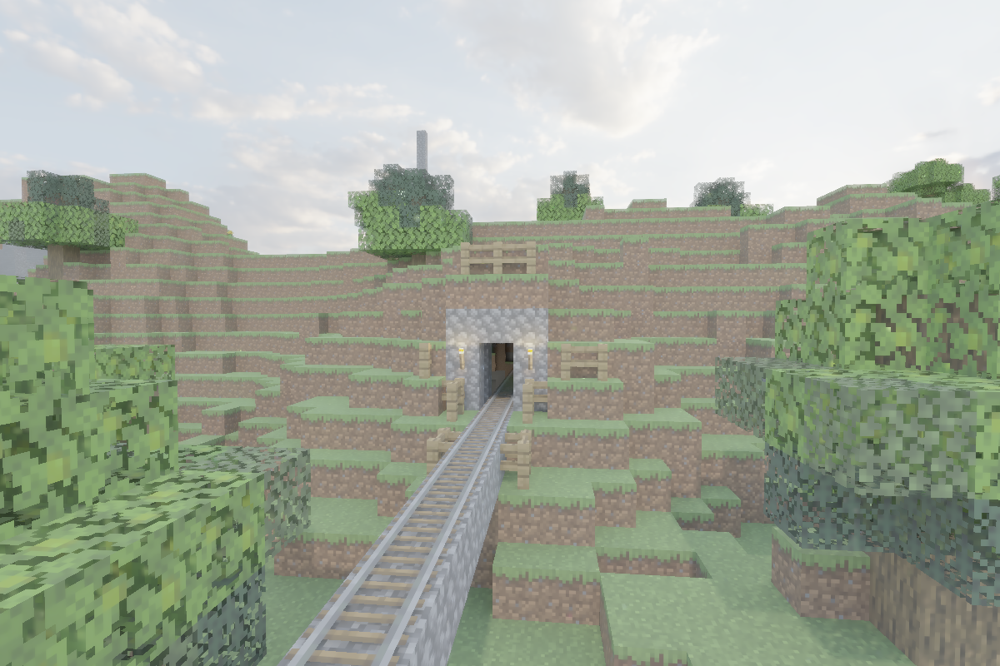 |

**Scene 2 — Lost Empire, View 2**

| No frame accumulation | Frame accumulation | Frame accumulation + denoiser |
| --- | --- | --- |
| 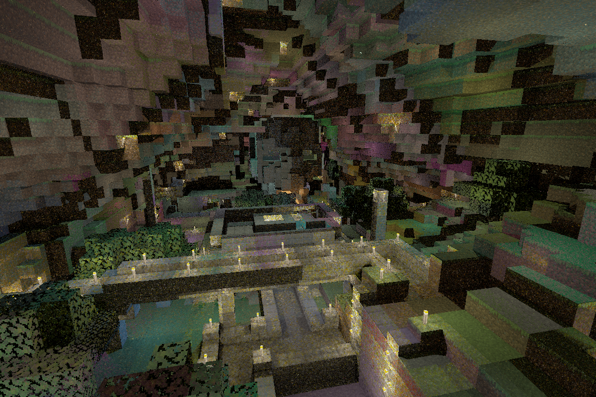 | 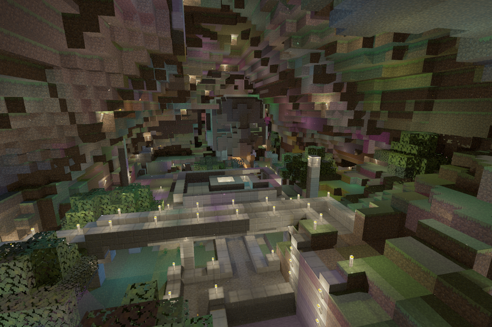 | 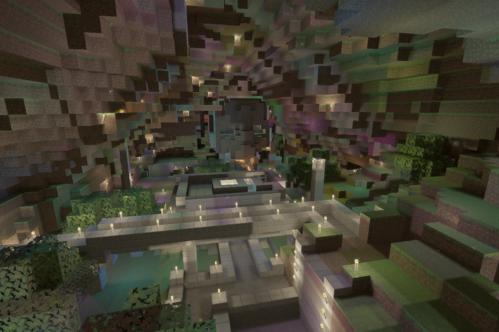 |

**Scene 3 — Subway**

| No frame accumulation | Frame accumulation | Frame accumulation + denoiser |
| --- | --- | --- |
| 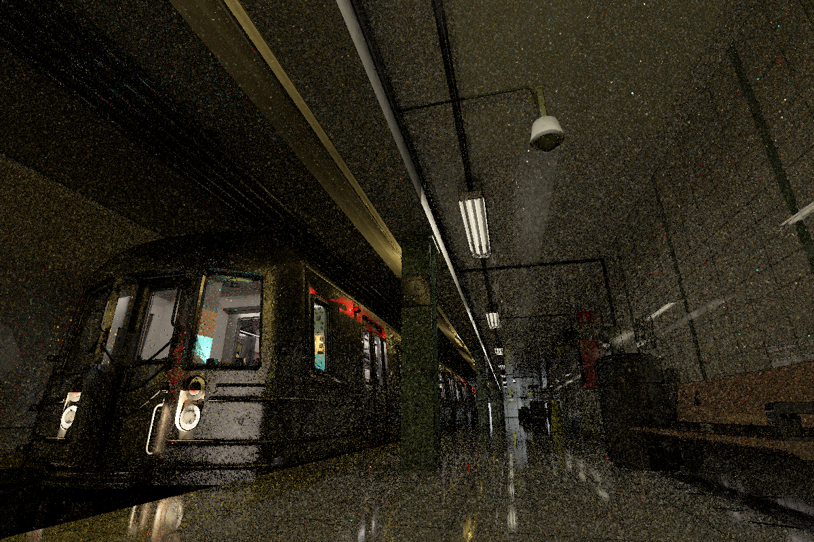 |  | 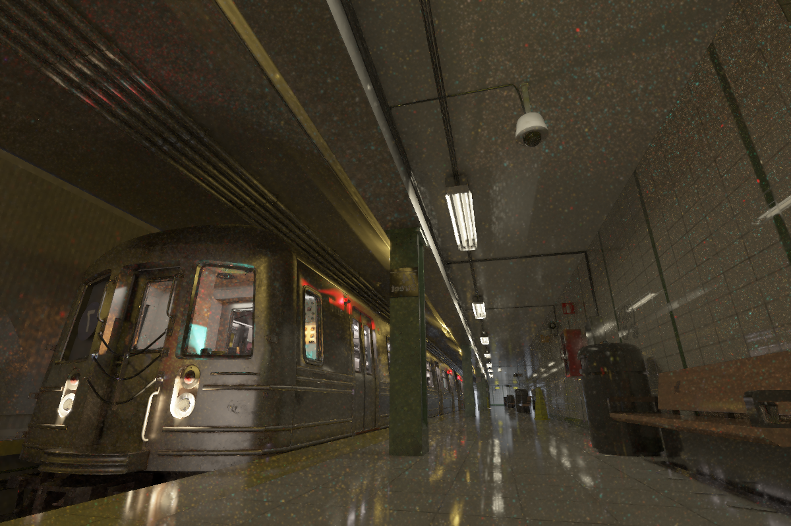 |

**Scene 5 — Bistro Interior**

| No frame accumulation | Frame accumulation | Frame accumulation + denoiser |
| --- | --- | --- |
| 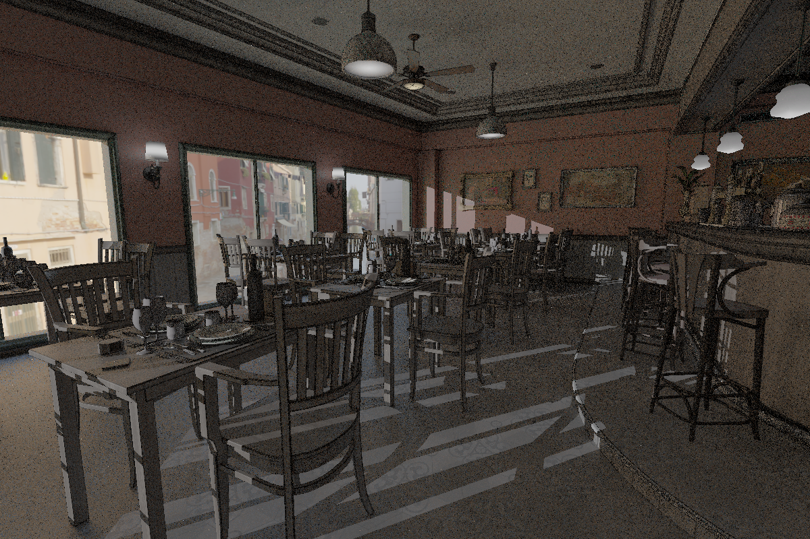 | 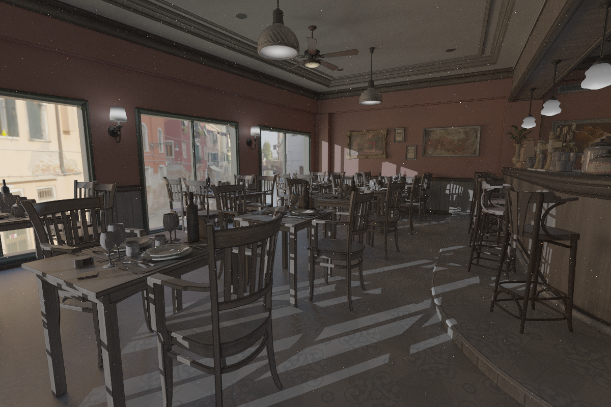 | 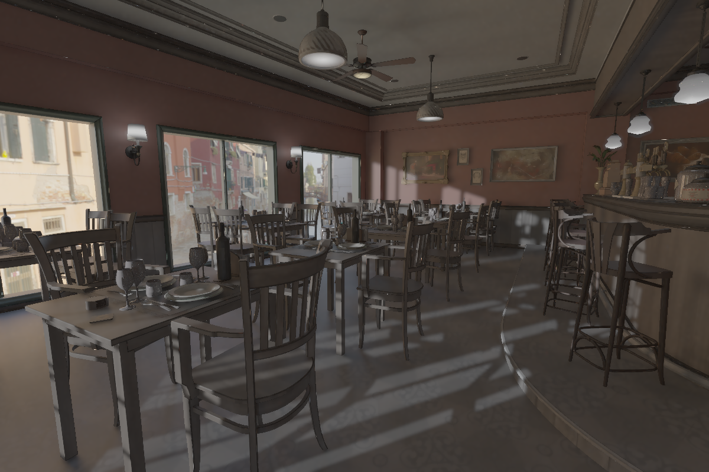 |

<details>
<summary>Capture settings and reproduction</summary>

All fifteen captures use **`RESTIR`**, **1200 × 800**, frame **512**, the camera recorded for each view in the manifest, jitter seed **0**, and an indirect bounce limit of **3**. The first column shows output frame 512 with reservoir reuse already running, without averaging earlier RGB frames. The other columns enable accumulation for 512 frames; the last also enables the denoiser. Each frame starts with eight PT seed candidates per hit pixel, so these captures are not labeled “1 spp.” All images use the same display transfer and no per-image exposure adjustment.

All four scenes use `environmentIntensity=1` and `indirectSunScale=1`. Subway's `useSun=0` keeps the directional sun disabled; Sponza, Lost Empire, and Bistro use their configured sun. Lost Empire's generated point-light colors also use seed **0**.

To capture the current XML scene settings under a new view name after a Release build, with the four scene assets installed, run from the repository root:

```powershell
python -m pip install numpy pillow
python img/restir-pt/capture.py --view my-view
```

The [capture script](img/restir-pt/capture.py) defaults to scenes **1, 2, 3, and 5** and all three modes. It writes isolated configurations and HDR diagnostics under `win64/readme-gallery`, preserving `assets/config.xml`. The [capture manifest](img/restir-pt/captures.json) records each view's camera, flags, frame counts, and file hashes. To reproduce a stored view, first set its camera attributes from the manifest in the XML; the script uses the current configuration and does not restore earlier cameras automatically.

Existing filenames with different scene or camera settings are protected: choose a new `--view` name to retain the earlier captures. Lost Empire's View 2 uses position `(2.742, 24.369, 1.084)`, pitch `-0.237`, and yaw `-6.489`. With that camera configured, capture its three modes under separate filenames:

```powershell
python img/restir-pt/capture.py --scenes 2 --view view-2
```

</details>

## Features

### Rendering and lighting

- **ReSTIR DI:** 64 light candidates are reduced in eight RIS groups, then resampled with visibility checks. Temporal and spatial reuse use the same visibility-aware target for direct illumination.
- **ReSTIR PT:** eight initial indirect path candidates per pixel, temporal reuse for a stationary camera, and spatial reuse. Reused paths are retraced from their random seeds at the receiving surface, reevaluating BRDFs, lighting, and visibility, including subpixel camera jitter. The active `RESTIR` mode combines DI and PT.
- **Reference path tracer:** NEE with RIS light selection, diffuse/specular BRDF sampling, emissive surfaces, shadow rays, and Russian roulette termination.
- **Many-light sampling:** directional sunlight, point lights, and textured emissive triangles. ReSTIR selects lights through local flux-weighted alias tables in a `32³` spatial grid. DI uses 64 RIS candidates; indirect PT uses one NEE candidate per bounce. Emissive triangles retain the project's original softened point-light model and scene lighting conventions.
- **PBR materials:** base color, metalness, roughness, normal maps, emission, and opacity handling in any-hit shaders. The shared BRDF code defaults to GGX microfacet specular and Frostbite diffuse.
- **Scene loading:** Assimp-based import, with OBJ, glTF, and FBX scene configurations; scene transforms, camera placement, and lighting are configured through XML.
- **Interactive inspection:** an SDL2 camera, Dear ImGui controls for indirect path depth and sunlight, and a statistics/log window with CPU frame timings. GPU frame and denoiser timestamps are read after the existing frame fence; diagnostic runs export `gpu-times.csv`.

### Render graph, RHI, and Vulkan

The existing, previously unused render graph has been reworked into the executor of the active rendering pipeline. Each frame, passes declare their imported images/buffers and required access, then record actual ray tracing, compute, copy, and drawing commands through the RHI (Rendering Hardware Interface).

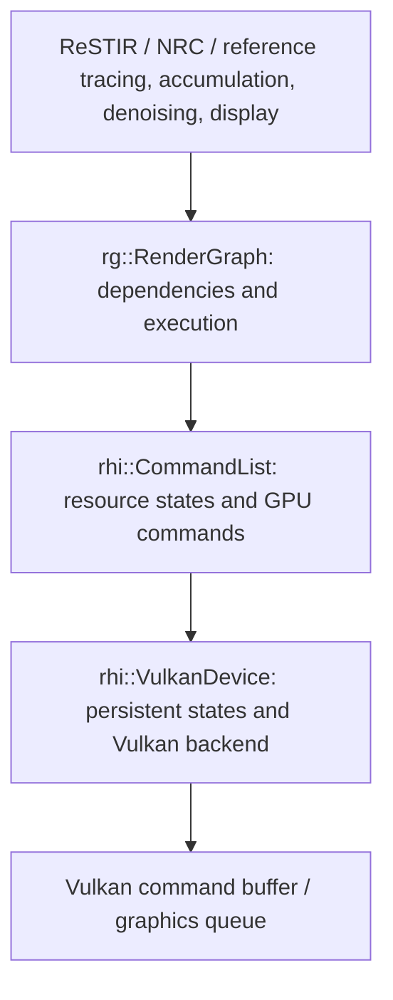
```mermaid
flowchart TD
    P["ReSTIR / NRC / reference tracing, accumulation, denoising, display"] --> G["rg::RenderGraph: dependencies and execution"]
    G --> C["rhi::CommandList: resource states and GPU commands"]
    C --> V["rhi::VulkanDevice: persistent states and Vulkan backend"]
    V --> GPU["Vulkan command buffer / graphics queue"]
```

The [graph](src/vk_render_graph.h) and [RHI contracts](src/rhi/rhi.h) contain no Vulkan types. The graph builds a stable dependency order for read-after-write, write-after-read, and write-after-write hazards, accepts explicit dependencies, and rejects cycles and reads of uninitialized resources. Imports of the same physical resource share one handle and dependency history, even when passes use different names.

These are real frame nodes: `ReSTIR.DI.Init`, `ReSTIR.PT.Init`, the DI reuse passes, `ReSTIR.PT.PrepareTemporal`, and `ReSTIR.PT.ReplayAndSpatial`; then either `ReSTIR.Shade` or `NRC.Train` → `NRC.Optimize` → `NRC.Inference`. `Accumulation.Mean` and `Accumulation.StoreHistory` feed the optional `Denoiser.Prefilter`, `Denoiser.Spatial0/1`, and `Denoiser.Temporal` passes, followed by `Display.TonemapAndImGui` and `Display.Present`. See [pass declarations](src/graphic_pipeline/vk_gi_raytrace_graphics_pipeline.cpp) and the [frame loop](src/vk_engine.cpp).

The [Vulkan backend](src/rhi/vulkan_rhi.cpp) translates declared states into image/buffer barriers and retains resource states across frames. Rebuilding the graph does not clear reservoir, accumulation, or denoiser history; their validity remains controlled by rendering settings and camera changes. Execution uses one graphics queue, without asynchronous scheduling or transient-memory aliasing.

The neutral [ResourceDevice](src/rhi/resource.h) also creates images/buffers and handles buffer updates and destruction. Accumulation and denoising use it for their images and per-frame uniform buffers, backed by [Vulkan/VMA allocations](src/rhi/vulkan_resources.cpp). Vulkan is currently the only backend. Engine initialization, scene uploads, GI/NRC allocations, descriptors, and pipeline creation still use native Vulkan; existing descriptor/framebuffer setup accesses native resources through explicit backend exports.

Open **Edit GI → Render graph** in ImGui to inspect the recorded pass order. Set `$env:RESTIR_GRAPH_DUMP = "frame-graph.dot"` before launching to export the first frame's compiled graph to a DOT file relative to the process working directory. The startup log also lists its pass order.

#### Vulkan features

The renderer uses a **bindless scene resource model**: textures and per-mesh vertex/index buffers live in descriptor arrays shared by rendering passes. Shaders select geometry and textures through mesh and material indices, avoiding descriptor rebinding for each object or material. The common scene set also exposes materials, lights, the top-level acceleration structure, and ReSTIR reservoirs.

The current ray tracing and compute paths use:

| Vulkan feature / technique | Application in the renderer |
| --- | --- |
| **Descriptor indexing / bindless resources** | `VK_EXT_descriptor_indexing`: runtime-sized shader resource arrays with non-uniform indexing (`NonUniformResourceIndex`), plus partially bound and update-after-bind descriptor bindings. See [scene descriptors](src/vk_resource_manager.cpp), [descriptor layouts](src/vk_descriptors.cpp), and [material/geometry access](shaders_slang/indirect_raytrace_gbuffer.rchit.slang). |
| **Hardware ray tracing** | `VK_KHR_acceleration_structure` and `VK_KHR_ray_tracing_pipeline`: mesh BLAS, a TLAS with scene instances, shader binding tables, and ray-generation, closest-hit, any-hit, and miss shaders for path tracing and ReSTIR. See [ray tracing setup](src/vk_raytracer_builder.cpp). |
| **Inline ray queries** | `VK_KHR_ray_query` performs shadow/visibility tests inside compute shading, including opacity checks through bindless material textures. ReSTIR shading and NRC inference share the [visibility implementation](shaders_slang/restir_visibility.h). |
| **Buffer device addresses** | GPU addresses provide geometry and scratch storage for acceleration-structure builds, shader binding tables, and cooperative-vector matrix conversion. See [ray tracing buffers](src/vk_raytracer_builder.cpp) and [matrix conversion](src/neural_shading/CoopVector.cpp). |
| **Compute shaders and cooperative vectors** | Compute passes perform reservoir reuse, lighting evaluation, and NRC training/inference. `RESTIR_NRC` uses `VK_NV_cooperative_vector`, FP16 weights and vector operations, FP32 gradient accumulation, and conversion between matrix layouts. See [NRC shaders](shaders_slang/nrc_training_mlp.h) and [neural shading](src/neural_shading/). |
| **Explicit memory and synchronization** | VMA allocations, staging uploads, storage buffers/images, image layout transitions, and pipeline barriers coordinate transfer, ray tracing, compute, and graphics work. The frame loop uses fences and binary semaphores with two frames in flight; accumulation keeps FP32 HDR history images. See [frame loop](src/vk_engine.cpp) and [accumulation pass](src/graphic_pipeline/vk_simple_accumulation_graphics_pipeline.cpp). |
| **SPIR-V reflection and shader specialization** | Slang and GLSL compile to SPIR-V. SPIRV-Reflect derives descriptor layouts and push-constant ranges; shader modules and descriptor layouts are cached. A specialization constant selects output encoding for the swapchain format. See [shader infrastructure](src/vk_shaders.cpp) and [final shading](src/graphic_pipeline/vk_gbuffer_shading_graphics_pipeline.cpp). |

Earlier and optional rendering paths also contain these Vulkan techniques:

| Technique | Implementation and current status |
| --- | --- |
| **Mesh/task shaders and meshlets** | `VK_NV_mesh_shader` pipelines implement meshlet-based rasterization, G-buffer generation, and a visibility buffer. Meshlet construction uses meshoptimizer. These raster paths and the meshlet preprocessing call are disabled in the current configuration. See [mesh processing](src/vk_mesh.cpp) and [raster shaders](shaders/). |
| **GPU culling and indirect multi-draw** | Compute/task shaders implement frustum and hierarchical depth (Hi-Z) occlusion culling. Compute-generated commands feed multiple mesh-task draws through `vkCmdDrawMeshTasksIndirectNV`; an indexed indirect draw wrapper is also present. The legacy frame-loop calls for culling, drawing, and depth-pyramid generation are disabled. See [draw-command generation](shaders/drawcmd.comp), [task shader](shaders/tri_mesh.task), and [draw wrappers](src/vk_command_buffer.cpp). |
| **Push descriptors** | `VK_KHR_push_descriptor` supplies resources to NRD compute passes. The implementation remains in the [denoiser integration](src/graphic_pipeline/vk_raytracer_denoiser_pass.cpp), whose initialization and dispatch are currently disabled. |
| **Validation and GPU timestamps** | Optional debug setup enables Vulkan validation, synchronization validation, GPU-assisted validation, and debug messages. GPU frame and denoiser timestamps are read after the existing frame fence; diagnostic runs export `gpu-times.csv`. See [device and frame setup](src/vk_engine.cpp) and [feature switches](src/vk_types.h). |

Device creation still requests some extensions used by disabled paths, including `VK_NV_mesh_shader` and `VK_KHR_push_descriptor`; the [build requirements](#requirements) describe the resulting hardware constraints.

### Component status

Some components are experimental, while others remain disabled in the current rendering loop:

| Component | Current state |
| --- | --- |
| Neural Radiance Cache | `RESTIR_NRC` trains on PT indirect radiance with Slang cooperative vectors, explicit backpropagation, FP32 gradient accumulation, and Adam. Hidden layers start with random weights; the output layer starts at zero. The result combines ReSTIR direct illumination, visible emission, and a blend of PT/NRC indirect lighting. Steps 1–32 use PT; steps 33–128 raise the cache contribution to 25%, retaining at least 75% PT so an undertrained cache cannot replace all traced indirect lighting. Non-finite predictions fall back to PT. |
| Separate ReSTIR GI passes | GI temporal and spatial reuse implementations are present; their draw calls are disabled in the active DI + PT pipeline. |
| Temporal and spatial denoiser | Optional in `RESTIR` and `RESTIR_NRC`, disabled by default. After FP32 accumulation, a geometry/material-aware prefilter suppresses isolated HDR outliers, two edge-aware à-trous passes use pixel strides `1` and `2`, and temporal reprojection stabilizes the displayed result. Separate denoiser history feeds only the temporal pass. |
| NVIDIA NRD | A separate integration and HLSL shader build support are present. NRD initialization and dispatch remain commented out; the **Denoiser** checkbox controls the filter above. |
| Frame accumulation | Enabled by default; toggle **Frame accumulation** in the UI or launch with `RESTIR_ACCUMULATION=0` to view unaveraged frames. Linear HDR radiance is averaged in FP32 using exact pixel reads. Camera, sunlight, or path-depth changes reset history; non-finite samples cannot poison later frames. The original display contrast curve is applied after averaging. |
| Raster G-buffer / visibility buffer | Mesh/task shader pipelines, meshlet processing, and depth-pyramid culling code are present. `GBUFFER_ON` and `VBUFFER_ON` default to `0`. |
| HDR / image-based lighting | `RESTIR` and `RESTIR_NRC` support optional FP32 equirectangular HDR environments through bindless textures. Primary misses show the environment; escaping BRDF rays contribute its lighting. The older environment/irradiance/prefiltered cubemap generator remains disabled. |
| NVIDIA DLSS Super Resolution | Optional Streamline 2.14.1 Vulkan backend for `RESTIR` and `RESTIR_NRC`. The graph prepares linear HDR, device depth, and camera/sky motion vectors, evaluates DLSS at the selected output resolution, then applies the existing tone mapping and full-resolution ImGui. |

This is a research and learning project. The gallery starts with reproducible captures of the current renderer and keeps older experiments below. Results depend on the scene, settings, and hardware.

## Build

### Requirements

The current build targets **Windows x64**. It uses bundled Windows SDL2 libraries, Win32 Vulkan definitions, and `.exe` shader compilers. Streamline is loaded dynamically when DLSS is requested.

- **Visual Studio 2022** with Desktop development with C++ and a Windows SDK, including FXC for NRD's default shader build.
- **CMake** with the `Visual Studio 17 2022` generator (3.21 or newer).
- **Vulkan SDK** with Vulkan 1.4 headers, `glslc.exe`, `slangc.exe`, and a SPIR-V-capable `dxc.exe`. Slang must support `spvCooperativeVectorNV`. The existing local build configuration uses SDK **1.4.309.0**; this is a configuration reference, not a tested minimum version.
- **A compatible NVIDIA GPU and driver.** Device creation requires Vulkan 1.4 plus NVIDIA-specific mesh shader and cooperative vector extensions. Ray tracing support alone is insufficient.

The device requirements in [vk_engine.cpp](src/vk_engine.cpp) include `VK_KHR_ray_tracing_pipeline`, `VK_KHR_acceleration_structure`, `VK_KHR_ray_query`, `VK_NV_mesh_shader`, `VK_NV_cooperative_vector`, and `VK_EXT_shader_replicated_composites`, along with descriptor indexing and buffer device addresses. **Cooperative vector support is requested in every render mode**, including `PATHTRACER` and `RESTIR`; `RESTIR_NRC` also requires cooperative vector training with FP32 accumulation.

Dependencies are stored under `third_party/`, including SDL2, GLM, volk, vk-bootstrap, VMA, Assimp, Dear ImGui, meshoptimizer, SPIRV-Reflect, NRD, and Streamline. Keep these directories when cloning or copying the project.

### Configure and compile

Run these commands in PowerShell. Set `VULKAN_SDK` to your installed SDK directory if the installer has not already configured it. The explicit compiler paths below avoid relying on CMake's shader compiler search paths; adjust them if your SDK layout differs.

```powershell
git clone https://github.com/collateraris/VulkanLearn2.git
Set-Location VulkanLearn2

cmake -S . -B build -G "Visual Studio 17 2022" -A x64 `
  "-DGLSLC:FILEPATH=$env:VULKAN_SDK/Bin/glslc.exe" `
  "-DSLANG:FILEPATH=$env:VULKAN_SDK/Bin/slangc.exe" `
  "-DDXC:FILEPATH=$env:VULKAN_SDK/Bin/dxc.exe" `
  -DASSIMP_BUILD_ZLIB=ON

cmake --build build --config Release --target vulkan_guide --parallel
```

The executable target is named **`vulkan_guide`**. With this generator, the executable is written to `bin/Release/vulkan_guide.exe`. Use a fresh build directory if an existing `build/` cache was configured with another generator.

The executable depends on the `Shaders` target, which compiles GLSL, Slang, and NRD HLSL sources to SPIR-V beside their source files. GLSL and Slang rules track the project's shared shader headers and Slang modules, so editing those dependencies triggers recompilation. NRD also builds its own shader containers, so the first build can involve substantial shader compilation.

### Render graph tests

`RESTIR_BUILD_TESTS` defaults to `ON`. The [standalone tests](tests/render_graph_tests.cpp) use a mock command list and require no GPU at runtime. They check dependency ordering, resource aliases, initialization, cycles, reset/recompile behavior, and command execution. For a build configured in `win64`, run the following; replace `win64` with `build` if using the configuration above.

```powershell
cmake --build win64 --config Release --target render_graph_tests
ctest --test-dir win64 -C Release --output-on-failure
```

### Runtime libraries

CMake automatically copies SDL2 and shared Assimp/NRD libraries beside `vulkan_guide.exe` after linking. Library paths come from the selected build configuration: Release receives `assimp-vc143-mt.dll` and `NRD.dll`, while Debug receives `assimp-vc143-mtd.dll` and `NRDd.dll` with the current MSVC toolset. An enabled Streamline build also deploys its signed SR runtime DLLs, Vulkan low-latency helper, and licenses to the adjacent `streamline/` directory.

Keep these DLLs and the `streamline/` directory together with the executable when moving a build. If files were removed from an existing output directory, rebuild the `vulkan_guide` target to restore them. Missing or unsupported DLSS falls back to native rendering; there is no mandatory Streamline DLL import.

### DLSS and 1440p output

Acquire the pinned [official Streamline 2.14.1 SDK](https://github.com/NVIDIA-RTX/Streamline/releases/tag/v2.14.1) and build:

```powershell
cmake -S . -B win64 -DRESTIR_FETCH_STREAMLINE=ON
cmake --build win64 --config Release --target vulkan_guide
```

The download is verified against its SHA-256 hash and extracted to `win64/streamline-sdk-2.14.1`. An existing SDK can be selected with `-DRESTIR_STREAMLINE_SDK_DIR=...`. Use `-DRESTIR_ENABLE_STREAMLINE=OFF` for a build without the SDK. The older files under `third_party/streamline` are no longer linked into the renderer.

In **Edit GI → Display / DLSS**, choose **2560 × 1440**, select **Quality**, **Balanced**, or **Performance**, then press **Apply (reload renderer)**. Settings are saved to `assets/config.xml`; reloading preserves the camera, sunlight, generated point-light colors, path depth, and filter choices while recreating the resolution-dependent resources and temporal histories. **Off** renders natively; **DLAA** reconstructs at native resolution without reducing the ray count. The UI shows both the internal render size and the output size.

```xml
<window title="Vulkan Learning Game Engine" width="2560" height="1440"></window>
<upscaling mode="performance"></upscaling>
```

DLSS obtains the internal resolution from the SDK. All ReSTIR launches, reservoirs, accumulation, denoising, and NRC screen-sized work use that internal size. The graph executes `DLSS.PrepareInputs` and `DLSS.SuperResolution` before tone mapping and ImGui. Inputs include FP16 linear HDR, normalized depth reconstructed from primary hits, and unjittered current-to-previous motion in pixels; the sky uses rotation-only motion. A Halton sequence supplies projection jitter. Camera cuts and changed rendering settings reset DLSS history.

The supplied configuration starts in 1440p Performance mode. A fresh DLSS launch enables the existing denoiser to provide a cleaner input signal; accumulation and denoising remain independent ImGui controls. Applying settings preserves your current filter choices. Quality retains more fine detail at a higher rendering cost; Performance reduces that cost and produces a softer image.

Example measurements in Bistro on an RTX 4090, driver 610.88, Release, with accumulation and denoising enabled:

| Mode | Internal resolution | Output resolution | Measured FPS |
|---|---|---|---:|
| Native | 1200 × 800 | 1200 × 800 | 57.4 |
| Native | 2560 × 1440 | 2560 × 1440 | 15.4 |
| DLSS Quality | 1707 × 960 | 2560 × 1440 | 33.4 |
| DLSS Balanced | 1485 × 835 | 2560 × 1440 | 44.0 |
| DLSS Performance | 1280 × 720 | 2560 × 1440 | 58.2 |

These are short measurements from frames 150–254 of 256-frame runs, using the same camera and lighting, with validation disabled and captures outside the timing window. FPS is derived from the measured frame loop; scene, camera, and system load affect the result. The Vulkan backend selects supported transformer preset K for Performance and Ultra Performance to avoid private NGX image-layout errors observed with the default Performance model on this SDK/driver.

This integration provides **Super Resolution**, with the existing denoiser as a separate option. Frame Generation and Ray Reconstruction are not enabled. It requires supported NVIDIA RTX hardware and a compatible driver. Quality and frame time depend on the scene and quality mode; upscaling does not guarantee pixel-identical native output. See the [NVIDIA integration guide](https://github.com/NVIDIA-RTX/Streamline/blob/main/docs/ProgrammingGuideDLSS.md) and the SDK's DLSS license for deployment terms.

On the tested machine, NVIDIA's driver telemetry can hang inside NGX shutdown after rendering has finished. A five-second watchdog reports this explicitly and ends only the renderer process with exit code `70`; it never unloads the SDK or destroys the Vulkan device underneath an active shutdown call. Applying display settings starts a fresh process with the camera, sunlight, path depth, and filter settings restored, so this driver issue cannot block the new renderer. Diagnostic reports distinguish this timeout from rendering or validation errors.

## Run and configure

### First launch

Edit [assets/config.xml](assets/config.xml) before launching. To start with the included Sponza scene, replace the existing `current_scene` and `render_mode` elements with:

```xml
<current_scene id="1"></current_scene>
<render_mode name="RESTIR"></render_mode>
```

Then launch **with `bin/Release` as the working directory**:

```powershell
Set-Location .\bin\Release
.\vulkan_guide.exe
```

Runtime paths such as `../../assets/`, `../../shaders/`, and `../../shaders_slang/` are relative to the **process working directory**, not the executable location. Visual Studio's debugger working directory is configured to use the executable directory. Launching from the repository root will resolve these paths incorrectly.

### Render modes

| `render_mode name` | Behavior |
| --- | --- |
| `RESTIR` | ReSTIR DI + PT with temporal and spatial reuse, followed by reservoir shading. |
| `PATHTRACER` | Reference path tracing with NEE and RIS light selection. |
| `RESTIR_NRC` | ReSTIR direct illumination and visible emission combined with PT/NRC indirect lighting, followed by optional frame accumulation. After warmup, the indirect blend keeps at least 75% PT and uses up to 25% NRC. PT reservoirs also supply the training targets. |

Mode and scene settings are read at startup. Restart the application after changing the XML. There are no command-line scene or rendering options.

### Scene presets

| Index | Model path relative to `assets/` | Asset availability |
| --- | --- | --- |
| `0` | `builder/scene.gltf` | Included: Atlanta office building. |
| `1` | `sponza.obj` | Included: Sponza. |
| `2` | `lost_empire.obj` | Included: Lost Empire. |
| `3` | `r46_subway/scene.gltf` | External asset; not tracked in the repository. |
| `4` | `Bistro_v5_2/BistroExterior.fbx` | External asset; not tracked in the repository. |
| `5` | `Bistro_v5_2/BistroInterior.fbx` | External asset; not tracked in the repository. |

The loader treats `current_scene.id` as a **zero-based position** in the `<scene_configs>` list, rather than looking up a scene's `id` attribute. Keep preset order and indices aligned when adding scenes. External scenes require their model files and referenced textures in the configured locations.

The XML also controls window title/resolution, scene scale and rotation, sunlight, an optional uniform point-light grid, and initial camera position/orientation. Model `radians` values are converted from degrees by the loader despite the attribute name; `camPitch` and `camYaw` are used directly as radians. The scene's `hdr` path selects its environment texture; cubemap sizes belong to the older, disabled IBL generator.

Two optional `<scene>` attributes configure lighting in `RESTIR` and `RESTIR_NRC`:

| Attribute | Default | Effect |
| --- | --- | --- |
| `environmentIntensity` | `0` | Scales the HDR environment; `0` disables loading and sampling it. |
| `indirectSunScale` | `0.015625` (`1/64`) | Scales sunlight at secondary surface hits; primary sunlight is unchanged. |

All six scene presets (`0`–`5`) explicitly set both attributes to `1`: each uses its configured HDR and full sunlight at secondary hits. `useSun` still controls whether a directional sun exists; Subway keeps it disabled. The defaults above apply when an attribute is omitted. Both values must be finite and non-negative. Environment visibility follows traced rays; there is no separate environment importance sampling or NEE, so small bright regions in an HDR map can remain noisy.

## Controls

Camera input is active on startup. Press **`M`** to suspend camera input while using the UI, then press it again to resume.

| Input | Action |
| --- | --- |
| Mouse | Look around while camera input is active. |
| `W` / `S` or Up / Down | Move forward / backward. |
| `A` / `D` or Left / Right | Strafe left / right. |
| `R` / `F` | Move up / down. |
| Left Shift | Move faster while held. |
| `Q` / `E` | Adjust yaw. |
| `Z` / `X` | Adjust pitch. |
| `M` | Toggle camera input for UI interaction. |
| Close window / Alt+F4 | Exit. |

In **Edit GI**, `Indirect numRays` controls the indirect bounce limit; it is not a samples-per-pixel setting. The UI starts at `3`; setting it to `0` disables indirect lighting, including the NRC prediction. The same panel lets you edit camera position/rotation and, when enabled for the scene, the sun direction and color. These changes reset frame accumulation and reservoir history; lighting or depth changes also restart NRC optimizer history and warmup.

Enable **Edit GI → Denoiser** in ImGui to reduce visible noise in `RESTIR` or `RESTIR_NRC`. It is off by default and works with **Frame accumulation** either on or off. The prefilter uses compatible surface neighbors to identify isolated HDR outliers and scales RGB together. Two spatial passes smooth the image using geometry and material guides; temporal reprojection then stabilizes the result and rejects history from incompatible or newly revealed surfaces. Background, visible emitters, and mirrors are protected, with reduced filtering on glossy surfaces.

Denoiser history stores the final stabilized image separately from linear accumulation and NRC training targets. The outlier prefilter expands from `3×3` to `5×5` around suspected bright samples to handle small clusters. Spatial passes start from the current prefiltered image each frame; history feeds only temporal stabilization, avoiding repeated spatial blurring. It resets on toggling, lighting or rendering-setting changes, and camera cuts. Unfiltered accumulation and ReSTIR/NRC data remain intact. Outlier suppression is biased and can attenuate legitimate isolated highlights; fine details can soften, and glossy reflections remain difficult to denoise.

## Rendering flow

The active implementation combines separate reservoirs for direct lighting (**DI**) and indirect paths (**PT**). [The GI pipeline](src/graphic_pipeline/vk_gi_raytrace_graphics_pipeline.cpp) schedules these passes:

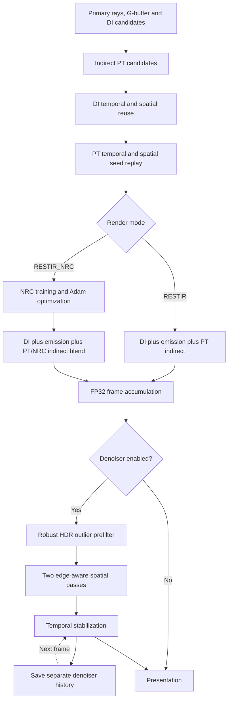
```mermaid
flowchart TD
    A[Primary rays, G-buffer and DI candidates] --> B[Indirect PT candidates]
    B --> C[DI temporal and spatial reuse]
    C --> D[PT temporal and spatial seed replay]
    D --> E{Render mode}
    E -->|RESTIR| F[DI plus emission plus PT indirect]
    E -->|RESTIR_NRC| G[NRC training and Adam optimization]
    G --> H[DI plus emission plus PT/NRC indirect blend]
    F --> I[FP32 frame accumulation]
    H --> I
    I --> J{Denoiser enabled?}
    J -->|Yes| K[Robust HDR outlier prefilter]
    J -->|No| L[Presentation]
    K --> M[Two edge-aware spatial passes]
    M --> N[Temporal stabilization]
    N --> O[Save separate denoiser history]
    O -.->|Next frame| N
    N --> L
```

1. **Find the surface and propose lights.** [DI initialization](shaders_slang/restir_di_start.rgen.slang) traces a jittered primary ray and writes position/object ID, normals, albedo/metalness, and emission/roughness. A local `32³` light grid supplies flux-weighted alias sampling. The 64 light candidates become eight group reservoirs; their representatives are resampled with shadow visibility included in the target.

2. **Trace indirect candidates.** [PT initialization](shaders_slang/restir_start.rgen.slang) generates eight independent seeds per hit pixel. [The shared path tracer](shaders_slang/restir_pathtrace.h) samples diffuse/specular BRDFs, carries their probability corrections in throughput, adds emission at secondary hits, and samples one shadow-tested light per bounce. Escaping rays sample the HDR environment when enabled. The default indirect bounce limit is `3`.

3. **Keep a weighted representative.** A [PT reservoir](shaders_slang/gi_pathtrace.h) stores one seed and its radiance, sample count `M`, accumulated selection weight, and final weight `W`. The [target and normalization](shaders_slang/restir_lighting.h) are `t = max(1e-8, luminance(L))` and `W = weightSum / (M × t_selected)`. Merging a source reservoir uses `t_receiver × W_source × M_source`. The tiny target floor preserves sampling support without adding radiance.

4. **Replay useful seeds.** [PT reuse](shaders_slang/restirPTSpacial.rgen.slang) first replays the previous seed at the current surface, limiting its represented count to ten times the initial count. It saves this temporal reservoir before spatial reuse. Up to seven random neighbor attempts in a `3×3` window use initial reservoirs, with distance/normal rejection; attempts can repeat. Each accepted seed retraces the path at the receiving pixel, reevaluating BRDFs, light choices, and visibility. This is identity mapping in primary sample space (`J = 1`), without vertex reconnection. Replay also handles changing subpixel hits on a stationary camera. DI performs separate temporal/spatial reuse, restricted to the same light-grid cell.

5. **Compose and display.** [Shading](shaders_slang/restirShade.comp.slang) sums visible emission, weighted DI, and `L_PT × W_PT`; `RESTIR_NRC` substitutes its PT/NRC indirect blend. Camera, lighting, or bounce-limit changes reset reservoir history. **Frame accumulation** independently averages linear RGB across frames; disabling it keeps reservoir reuse active. The optional denoiser keeps a third, separate history and filters only display output.

**Lighting compatibility:** direct illumination and surface emission use the emissive texture multiplied by `emissiveFactor`. The original `emissiveStrength` convention remains in flux/radius estimation and indirect NEE. Indirect soft point-light proxies use an explicit `1/64` compatibility power scale, separate from candidate counts and reservoir normalization. Environment radiance is added separately; directional sunlight uses `indirectSunScale` instead of the point-proxy scale.

### Compared with the original ReSTIR PT

Here, “original” means [Lin et al., SIGGRAPH 2022](https://research.nvidia.com/labs/rtr/publication/lin2022generalized/) and the authors' implementation. GRIS supplies a framework for correlated sample reuse and conditional convergence guarantees; this renderer implements a smaller set of its practical mechanisms.

| Aspect | Original algorithm / authors' implementation | This project |
| --- | --- | --- |
| Path shifts | Reconnection, random replay, and hybrid mappings. Hybrid replay regenerates a prefix and reconnects to a stored vertex with the corresponding Jacobian. [Shift implementation](https://github.com/DQLin/ReSTIR_PT/blob/master/Source/RenderPasses/ReSTIRPTPass/Shift.slang). | Full seed replay only, with `J = 1` in primary sample space. Random replay already exists in the original; this project omits reconnection and hybrid mapping. |
| Resampling weights | Generalized resampling MIS accounts for proposal/shift relationships; the supplement develops pairwise and defensive constructions. [Supplement, §S1](https://graphics.cs.utah.edu/research/projects/gris/GRIS_supplemental.pdf). | Luminance targets, source `W × M`, count limits, and neighborhood rejection. The original's broader MIS machinery is not implemented; unbiasedness or convergence is not established for these choices. |
| Moving cameras | Motion vectors locate previous surfaces, with previous visibility data and dynamic-scene updates. [Temporal reuse](https://github.com/DQLin/ReSTIR_PT/blob/master/Source/RenderPasses/ReSTIRPTPass/TemporalReuse.cs.slang). | Temporal reservoir reuse requires a stationary camera; movement invalidates it. Denoiser reprojection is a separate image-filtering feature. |
| Renderer additions | ReSTIR PT addresses reuse of multi-bounce light transport. [Paper](https://research.nvidia.com/labs/rtr/publication/lin2022generalized/). | Separate DI reservoirs, local soft point-light conventions, NRC blending, frame averaging, and the custom denoiser form this renderer's surrounding pipeline. |

Reservoirs store compact seed state, but each accepted reuse still retraces an indirect path. Eight initial candidates plus replays mean the ray workload exceeds one path per pixel. The [gallery](#gallery) compares settings of this project; it does not benchmark against the authors' renderer.

## HDR accumulation diagnostics

For brightness and convergence checks, the renderer can read back FP32 linear HDR output at selected frame numbers and exit automatically. By default, captures follow the displayed output, including denoising when enabled, before tone mapping. From `bin/Release` (or `bin/Debug`), run:

```powershell
$env:RESTIR_DIAGNOSTICS_FRAMES = '1,32,128,512,2048'
$env:RESTIR_DIAGNOSTICS_MAX_FRAMES = '2048'
$env:RESTIR_DIAGNOSTICS_OUTPUT = [IO.Path]::GetFullPath('..\..\win64\runtime\restir')
.\vulkan_guide.exe
Remove-Item Env:RESTIR_DIAGNOSTICS_FRAMES, Env:RESTIR_DIAGNOSTICS_MAX_FRAMES, Env:RESTIR_DIAGNOSTICS_OUTPUT
```

Set `$env:RESTIR_ACCUMULATION = '0'` before launching to capture individual frames with ReSTIR reservoir reuse still active; remove the variable to restore the default. Frame `1` never contains frame averaging, even when accumulation is enabled.

Set `$env:RESTIR_DENOISER = '1'` to enable the denoiser at startup. During diagnostic runs, `RESTIR_DIAGNOSTICS_RAW=1` captures the unfiltered accumulation history regardless of the denoiser state; combine it with `RESTIR_ACCUMULATION=0` for unfiltered individual frames. For automated switching checks, `RESTIR_DIAGNOSTICS_DENOISER_TOGGLE_FRAMES=16,32` flips the denoiser state before rendering frames `16` and `32`. Remove these environment variables after the comparison to restore the defaults.

For camera-history checks, `RESTIR_DIAGNOSTICS_CAMERA_MOTION=1` moves and turns the camera during frames `65`–`128`, then stops; adding `RESTIR_DIAGNOSTICS_CAMERA_CUT=1` makes an abrupt turn at frame `192`. Diagnostic runs use a hidden window and also save `gpu-times.csv` with GPU frame and denoiser timings read after the existing frame fence, without an extra timing wait.

The output directory contains linear RGB `.pfm` captures before tone mapping and `frames.csv` with RGB/luminance means, luminance range and deviation, and non-finite/black pixel counts. Compare late-frame luminance at a fixed camera and lighting setup; NRC warmup can change brightness before training settles. Captures wait for GPU completion, so they are unsuitable for performance measurements. Frame numbers start at `1`; omitting `MAX_FRAMES` exits after the last requested capture, while setting only `MAX_FRAMES` runs without image readback. Diagnostics lock camera input and set both the camera jitter seed and the generated point-light color seed to `0` for repeatable captures. Diagnostics are disabled when neither frame variable is set.

## Archive

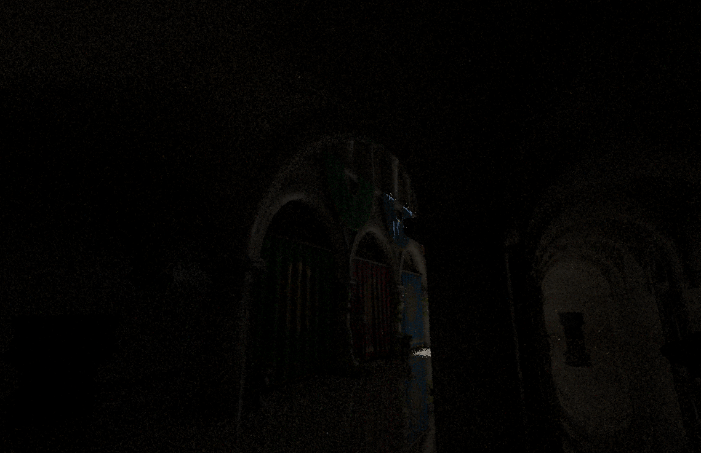

*Archived project capture, labeled 1 sample per pixel (spp) without frame accumulation in the original README. Current candidate counts and reservoir reuse are explained in [Rendering flow](#rendering-flow).*

### Historical reference path tracer vs. ReSTIR PT

Archived Bistro interior captures retain their original **1 spp without frame accumulation** labels; those labels describe the older implementation. The original README describes the reference renderer as based on *Ray Tracing Gems II*, extended with emissive triangle and NEE RIS support.

| Reference path tracer with NEE | ReSTIR PT |
| --- | --- |
| 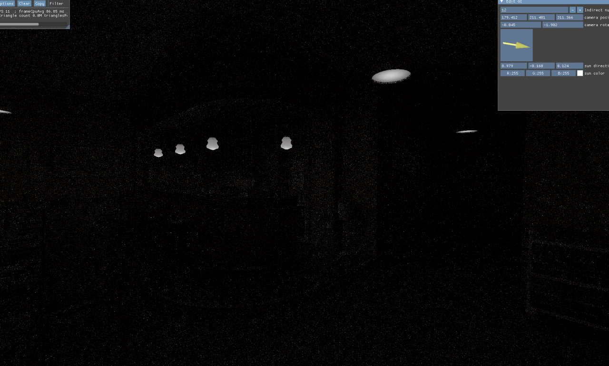 | 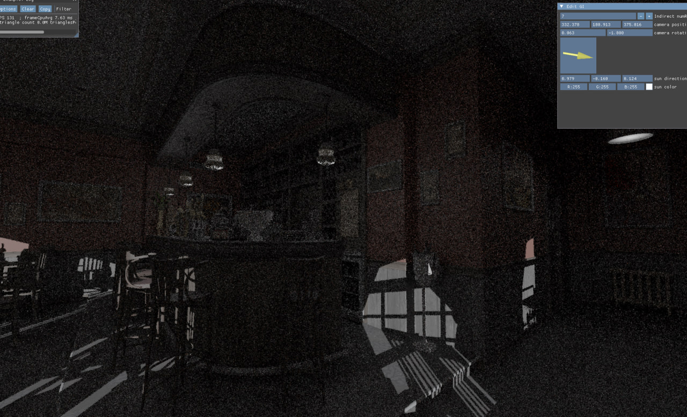 |
| 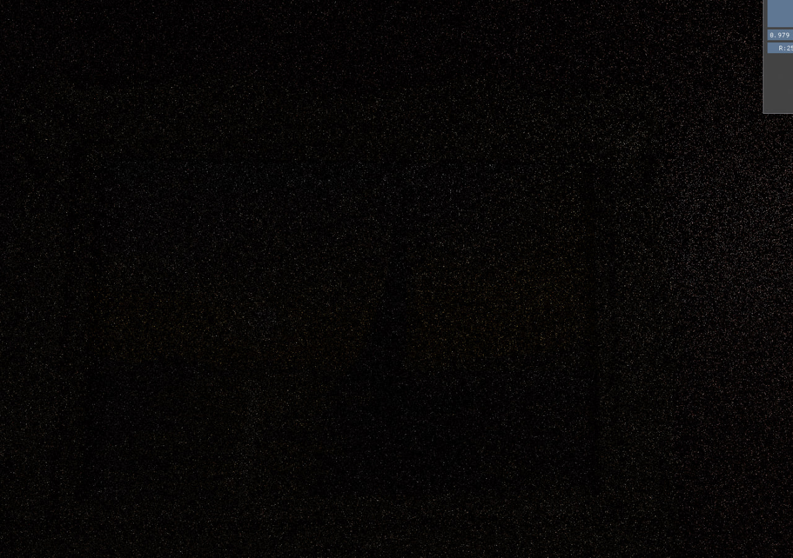 | 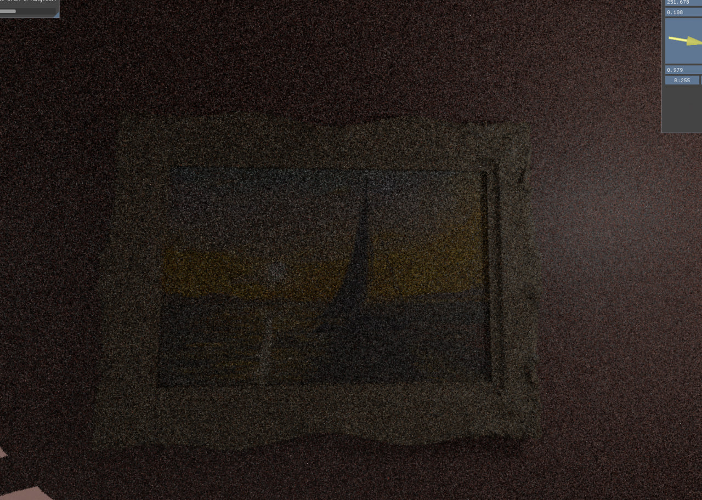 |

<details>
<summary>More ReSTIR PT captures</summary>

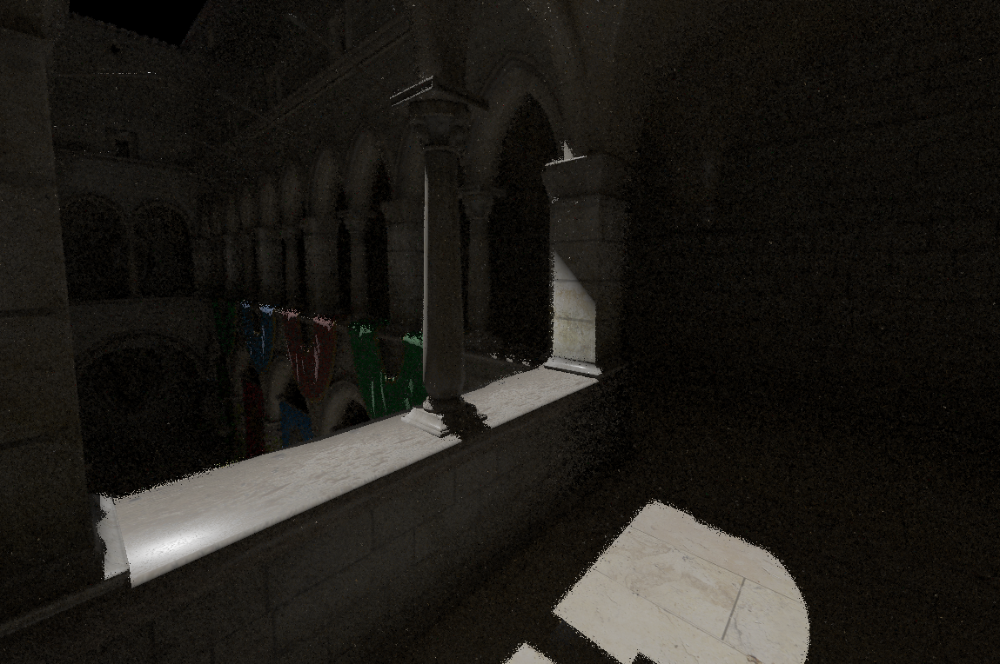
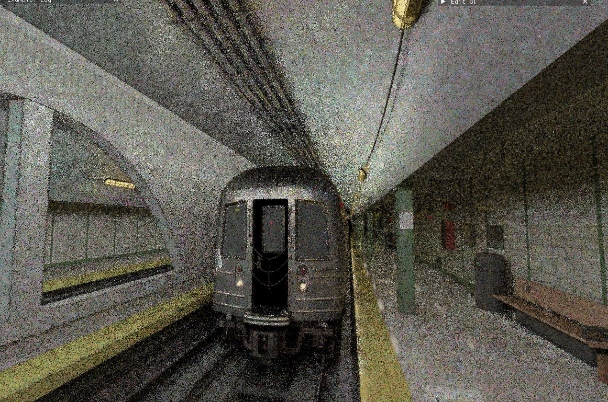
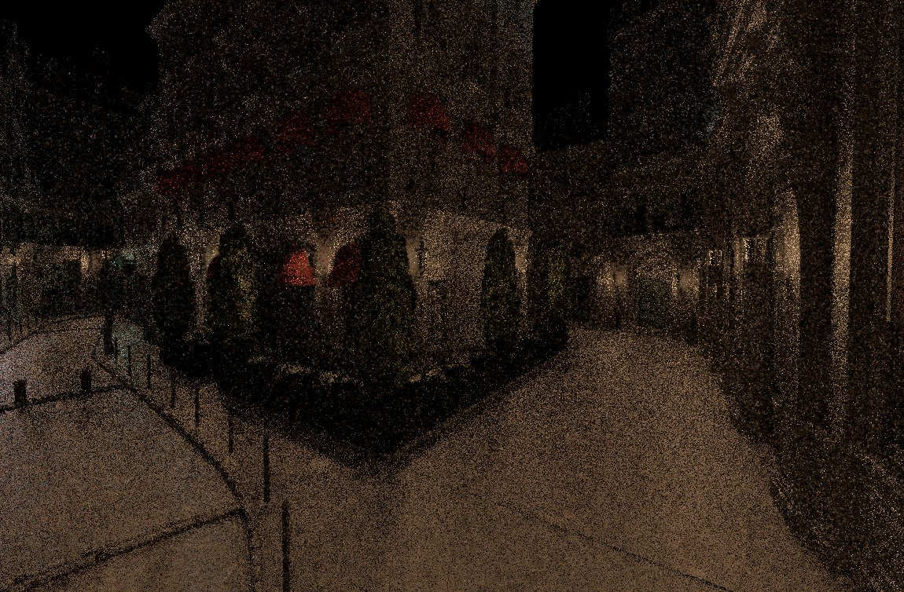

</details>

## Code map

| Path | Purpose |
| --- | --- |
| [src/vk_engine.cpp](src/vk_engine.cpp) | Vulkan/device setup, scene initialization, frame loop, and mode selection. |
| [src/graphic_pipeline/](src/graphic_pipeline/) | ReSTIR, reference tracing, NRC, denoising, and presentation passes. |
| [src/vk_render_graph.h](src/vk_render_graph.h), [src/vk_render_graph.cpp](src/vk_render_graph.cpp) | Backend-neutral frame graph, resource dependencies, validation, execution, and DOT export. |
| [src/rhi/](src/rhi/) | Neutral command/resource interfaces, resource creation for accumulation/denoising, and the Vulkan backend with persistent resource-state tracking. |
| [tests/render_graph_tests.cpp](tests/render_graph_tests.cpp) | Standalone graph tests with a mock RHI command list. |
| [src/vk_light_manager.cpp](src/vk_light_manager.cpp) | Scene lights, spatial light grid, and alias tables. |
| [src/vk_assimp_loader.cpp](src/vk_assimp_loader.cpp) | Model, material, and texture import. |
| [src/neural_shading/](src/neural_shading/) | NRC network layout, parameters, and cooperative vector utilities. |
| [shaders_slang/](shaders_slang/) | Active DI/PT shaders, BRDF code, NRC training/optimizer/inference, and neural shading helpers. |
| [shaders/](shaders/) | GLSL implementations, raster/mesh shaders, accumulation, and IBL passes. |
| [src/sys_config/](src/sys_config/) | XML parsing and resource path definitions. |
| [assets/](assets/) | Configuration, included scenes, textures, and asset credits. |
| [third_party/](third_party/) | Bundled libraries, SDK integrations, and shader compiler binaries. |
| [img/](img/) | Project screenshots. |

## Troubleshooting

- **CMake cannot find a shader compiler:** check `VULKAN_SDK` and the `GLSLC`, `SLANG`, and `DXC` cache entries. A `slangc.exe` that lacks cooperative vector support cannot compile the current shader target.
- **NRD shader tools fail to configure:** verify that the Windows SDK includes FXC/DXC. NRD's own ShaderMake configuration also searches for these tools; it is separate from the top-level `DXC` variable.
- **A DLL is missing at startup:** regenerate CMake and rebuild `vulkan_guide` in the configuration you intend to run. The post-build step copies the matching runtime libraries beside the executable. Debug DLLs with a `d` suffix cannot replace their Release counterparts.
- **Configuration, models, or shaders cannot be loaded:** check the working directory and the selected scene. Subway and Bistro presets refer to assets that are not included in a fresh clone.
- **No suitable GPU / device creation fails:** compare the GPU's supported features and extensions with `init_vulkan()` in `src/vk_engine.cpp`. Disabling NRC in XML does not remove the cooperative vector requirement.
- **Indirect lighting is missing:** increase `Indirect numRays` above `0`. For environment lighting in `RESTIR` or `RESTIR_NRC`, set the scene's `environmentIntensity` above `0` and provide a valid `hdr` path. A black background is expected when the environment is disabled.
- **Shader edits do not appear:** rebuild `Shaders` and restart the application. Shared GLSL/Slang headers and Slang modules are build dependencies; rerun CMake when adding new shader files, and rebuild the executable when changing shared CPU/GPU layouts.

## Development direction

The original goals remain the focus of the project: improve the shading model and ReSTIR implementation, develop NRC acceleration, and refine denoising. NRC now contributes to the final image, but PT still generates its training targets every frame. Further work includes improving cache quality and reducing tracing cost, extending reservoir temporal reuse to moving cameras, and improving denoised specular detail while reducing outlier-filtering bias.

## Credits

- The renderer retains the `vulkan_guide` target and Vulkan Guide-based project structure.
- The BRDF implementation credits Jakub Boksansky's *Crash Course in BRDF Implementation*; attribution is preserved in [shaders_slang/brdf.h](shaders_slang/brdf.h).
- Sponza was created by Frank Meinl; see [assets/README.md](assets/README.md).
- Lost Empire comes from the Vokselia Minecraft world and was converted to OBJ by Morgan McGuire using Mineways; see [assets/copyright.txt](assets/copyright.txt).
- The Atlanta office building is by 99.Miles, under CC BY 4.0; see [assets/builder/license.txt](assets/builder/license.txt).
- Bundled dependencies retain their own license files under `third_party/`. External scene assets retain their respective authors' terms.
