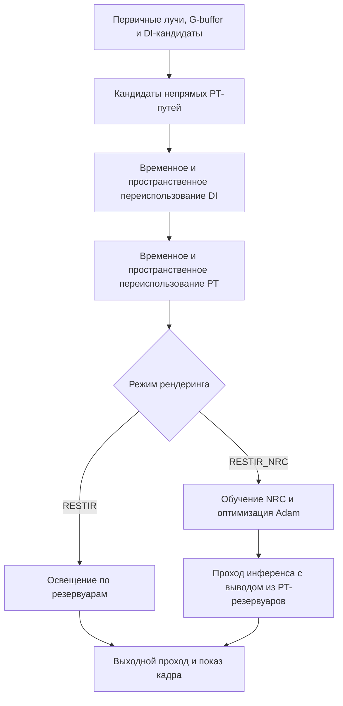

# VulkanLearn2

**Экспериментальный Vulkan-рендерер для ReSTIR: прямого и глобального освещения и трассировки путей.**

[English](README.md) | Русский

VulkanLearn2 — проект на C++20 для изучения ресэмплинга резервуаров и освещения при малом числе сэмплов. В нём есть эталонный трассировщик путей с next event estimation (NEE), конвейер ReSTIR DI + PT, светящиеся треугольники и экспериментальный Neural Radiance Cache (NRC). Текущие режимы рендеринга используют шейдеры Slang; в проекте также сохранены реализации на GLSL.


*Существующий скриншот проекта: ReSTIR PT при 1 сэмпле на пиксель (spp), без накопления кадров. При этом ReSTIR переиспользует резервуары между кадрами — это отдельный механизм, не усреднение готовых изображений.*

[Возможности](#возможности) · [Сборка](#сборка) · [Запуск и настройка](#запуск-и-настройка) · [Управление](#управление) · [Галерея](#галерея) · [Карта кода](#карта-кода)

## Возможности

### Рендеринг и освещение

- **ReSTIR DI:** генерация кандидатов источников света через resampled importance sampling (RIS), затем временное и пространственное переиспользование резервуаров для прямого освещения.
- **ReSTIR PT:** генерация непрямых путей, временное переиспользование и пространственное переподключение путей с учётом якобиана. Рабочий режим `RESTIR` объединяет DI и PT.
- **Эталонный path tracer:** NEE с выбором источников через RIS, сэмплирование диффузной и зеркальной составляющих BRDF, светящиеся поверхности, теневые лучи и завершение путей методом русской рулетки.
- **Сэмплирование множества источников:** направленный солнечный свет, точечные источники и светящиеся треугольники с текстурами. Световой поток оценивается на GPU; пространственная сетка и alias-таблицы для её ячеек используются при выборе света в шейдерах ReSTIR.
- **PBR-материалы:** базовый цвет, металличность, шероховатость, карты нормалей, эмиссия и обработка прозрачности в any-hit шейдерах. Общий код BRDF по умолчанию использует микрофасеточную модель GGX для зеркальной составляющей и Frostbite diffuse для диффузной.
- **Загрузка сцен:** импорт через Assimp, с конфигурациями сцен OBJ, glTF и FBX; преобразования сцены, положение камеры и освещение задаются через XML.
- **Интерактивная настройка:** камера на SDL2, интерфейс Dear ImGui для глубины непрямых путей и солнечного света, окно статистики и лога со временем кадра на CPU/GPU.

### Экспериментальные и отключённые возможности

В репозитории также есть реализации, которые не включены в текущий цикл рендеринга:

| Компонент | Текущее состояние |
| --- | --- |
| Neural Radiance Cache | `RESTIR_NRC` запускает обучение, оптимизацию Adam и проход инференса с cooperative vectors в Slang. Выходной шейдер пока берёт непрямое освещение из PT-резервуара; предсказание сети не используется в итоговом изображении. |
| Отдельные проходы ReSTIR GI | Реализованы временное и пространственное переиспользование GI; их вызовы отключены в рабочем конвейере DI + PT. |
| NVIDIA NRD | Есть интеграция денойзера и сборка HLSL-шейдеров. Инициализация и запуск денойзера закомментированы. |
| Накопление кадров | Есть проход накопления и логика сброса истории, но `shaders/accumulate.frag` сейчас выводит текущий кадр без усреднения. |
| Растеризация G-buffer / visibility buffer | Есть конвейеры с mesh/task шейдерами, обработка meshlet и код отсечения с пирамидой глубины. `GBUFFER_ON` и `VBUFFER_ON` по умолчанию равны `0`. |
| HDR / image-based lighting | Есть генерация карт окружения, irradiance и prefiltered cubemap. Инициализация IBL отключена; текущие трассировщики выводят чёрный фон при промахе луча. |
| Streamline | Есть SDK и код обёртки; `STREAMLINE_ON` по умолчанию равен `0`. DLSS не включён в рабочий рендеринг. |

Это исследовательский и учебный проект. Галерея показывает результаты существующих экспериментов; она не является бенчмарком и не гарантирует идентичное изображение в текущей ревизии.

## Сборка

### Требования

Текущая сборка рассчитана на **Windows x64**. Она использует включённые в репозиторий Windows-библиотеки SDL2, import-библиотеку Streamline, Win32-определения Vulkan и `.exe`-компиляторы шейдеров.

- **Visual Studio 2022** с компонентами разработки классических приложений на C++ и Windows SDK, включая FXC для стандартной сборки шейдеров NRD.
- **CMake** с генератором `Visual Studio 17 2022` — версия 3.21 или новее.
- **Vulkan SDK** с заголовками Vulkan 1.4, `glslc.exe`, `slangc.exe` и `dxc.exe` с поддержкой SPIR-V. Slang должен поддерживать `spvCooperativeVectorNV`. Существующая локальная конфигурация сборки использует SDK **1.4.309.0**; это ориентир по конфигурации, а не проверенная минимальная версия.
- **Совместимые видеокарта NVIDIA и драйвер.** Создание устройства требует Vulkan 1.4 и NVIDIA-расширений для mesh shaders и cooperative vectors. Одной поддержки трассировки лучей недостаточно.

Требования к устройству в [vk_engine.cpp](src/vk_engine.cpp) включают `VK_KHR_ray_tracing_pipeline`, `VK_KHR_acceleration_structure`, `VK_KHR_ray_query`, `VK_NV_mesh_shader`, `VK_NV_cooperative_vector` и `VK_EXT_shader_replicated_composites`, а также descriptor indexing и buffer device addresses. **Поддержка cooperative vectors запрашивается во всех режимах**, включая `PATHTRACER` и `RESTIR`.

Зависимости находятся в `third_party/`: SDL2, GLM, volk, vk-bootstrap, VMA, Assimp, Dear ImGui, meshoptimizer, SPIRV-Reflect, NRD и Streamline. Сохраняйте эти каталоги при клонировании или копировании проекта.

### Конфигурация и компиляция

Выполните команды в PowerShell. Если установщик не настроил `VULKAN_SDK`, задайте в этой переменной каталог установленного SDK. Явные пути к компиляторам позволяют не зависеть от путей поиска в CMake; скорректируйте их, если структура вашего SDK отличается.

```powershell
git clone https://github.com/collateraris/VulkanLearn2.git
Set-Location VulkanLearn2

cmake -S . -B build -G "Visual Studio 17 2022" -A x64 `
  "-DGLSLC:FILEPATH=$env:VULKAN_SDK/Bin/glslc.exe" `
  "-DSLANG:FILEPATH=$env:VULKAN_SDK/Bin/slangc.exe" `
  "-DDXC:FILEPATH=$env:VULKAN_SDK/Bin/dxc.exe" `
  -DASSIMP_BUILD_ZLIB=ON

cmake --build build --config Release --target vulkan_guide --parallel
```

Исполняемая цель называется **`vulkan_guide`**. С этим генератором программа собирается в `bin/Release/vulkan_guide.exe`. Если существующий кеш в `build/` создан другим генератором, используйте новый каталог сборки.

Исполняемая цель зависит от `Shaders`, которая компилирует GLSL, Slang и HLSL-шейдеры NRD в SPIR-V рядом с исходниками. NRD дополнительно собирает собственные контейнеры шейдеров, поэтому первая сборка включает значительный объём компиляции шейдеров.

### Библиотеки для запуска

Поместите SDL2 и Release-версии DLL Assimp/NRD рядом с программой. Для приведённой выше сборки выполните из корня репозитория:

```powershell
Copy-Item .\third_party\SDL2-2.28.2\lib\x64\SDL2.dll .\bin\Release\
Copy-Item .\third_party\streamline\bin\x64\sl.interposer.dll .\bin\Release\

Get-ChildItem .\build\third_party -Recurse -File -Include 'assimp-*.dll', 'NRD.dll' |
  Where-Object { $_.Directory.Name -eq 'Release' } |
  Copy-Item -Destination .\bin\Release\
```

Конфигурация DLL должна совпадать с конфигурацией программы. Для Debug каталог вывода и имена библиотек могут отличаться. CMake продолжает линковать NRD и import-библиотеку Streamline, хотя их интеграции в рендеринг отключены.

## Запуск и настройка

### Первый запуск

Перед запуском откройте [assets/config.xml](assets/config.xml). Для старта с включённой в репозиторий сценой Sponza замените существующие элементы `current_scene` и `render_mode` на:

```xml
<current_scene id="1"></current_scene>
<render_mode name="RESTIR"></render_mode>
```

Затем запустите программу **с рабочим каталогом `bin/Release`**:

```powershell
Set-Location .\bin\Release
.\vulkan_guide.exe
```

Пути `../../assets/`, `../../shaders/` и `../../shaders_slang/` разрешаются относительно **рабочего каталога процесса**, а не расположения исполняемого файла. Для отладчика Visual Studio рабочим каталогом назначена папка программы. При запуске из корня репозитория эти пути будут разрешаться неправильно.

### Режимы рендеринга

| `render_mode name` | Поведение |
| --- | --- |
| `RESTIR` | ReSTIR DI + PT с временным и пространственным переиспользованием и последующим расчётом освещения по резервуарам. |
| `PATHTRACER` | Эталонная трассировка путей с NEE и выбором источников света через RIS. |
| `RESTIR_NRC` | ReSTIR с экспериментальными проходами обучения, оптимизации и инференса NRC; итоговое непрямое освещение пока берётся из PT-резервуаров. |

Режим и сцена читаются при старте. После изменения XML перезапустите приложение. Аргументы командной строки для выбора сцены или режима не реализованы.

### Предустановки сцен

| Индекс | Путь к модели относительно `assets/` | Наличие ресурсов |
| --- | --- | --- |
| `0` | `builder/scene.gltf` | Включена: офисное здание Atlanta. |
| `1` | `sponza.obj` | Включена: Sponza. |
| `2` | `lost_empire.obj` | Включена: Lost Empire. |
| `3` | `r46_subway/scene.gltf` | Внешняя сцена; не отслеживается в репозитории. |
| `4` | `Bistro_v5_2/BistroExterior.fbx` | Внешняя сцена; не отслеживается в репозитории. |
| `5` | `Bistro_v5_2/BistroInterior.fbx` | Внешняя сцена; не отслеживается в репозитории. |

Загрузчик трактует `current_scene.id` как **позицию с нуля** в списке `<scene_configs>`, а не ищет сцену по атрибуту `id`. При добавлении сцен сохраняйте соответствие порядка и индексов. Для внешних сцен нужны файлы моделей и связанные текстуры по указанным путям.

XML также задаёт название и разрешение окна, масштаб и поворот сцены, солнечный свет, необязательную равномерную сетку точечных источников, начальную позицию и ориентацию камеры. Несмотря на имя атрибута, `radians` для модели преобразуется загрузчиком из градусов; `camPitch` и `camYaw` используются непосредственно как радианы. HDR-пути и размеры cubemap сохранены для отключённого IBL-конвейера.

## Управление

При запуске управление камерой включено. Нажмите **`M`**, чтобы приостановить ввод камеры и работать с интерфейсом; повторное нажатие вернёт управление камерой.

| Ввод | Действие |
| --- | --- |
| Мышь | Осмотр при активном управлении камерой. |
| `W` / `S` или стрелки вверх / вниз | Движение вперёд / назад. |
| `A` / `D` или стрелки влево / вправо | Движение влево / вправо. |
| `R` / `F` | Движение вверх / вниз. |
| Левый Shift | Ускорение при удержании. |
| `Q` / `E` | Поворот по горизонтали. |
| `Z` / `X` | Поворот по вертикали. |
| `M` | Переключение ввода камеры для работы с UI. |
| Закрытие окна / Alt+F4 | Выход. |

В панели **Edit GI** параметр `Indirect numRays` задаёт предел непрямых отражений, а не число сэмплов на пиксель. Начальное значение в UI — `0`; увеличьте его для изучения непрямого освещения. Здесь же можно менять положение и поворот камеры, а при включённом для сцены солнце — его направление и цвет.

## Порядок рендеринга

Рабочий ReSTIR-конвейер собран в [vk_gi_raytrace_graphics_pipeline.cpp](src/graphic_pipeline/vk_gi_raytrace_graphics_pipeline.cpp):



В этом конвейере данные материалов и геометрии первого пересечения формируются трассировкой лучей. Выходной проход сейчас не усредняет кадры; NRD не запускается.

## Галерея

### Эталонный path tracer и ReSTIR PT

Существующие скриншоты интерьера Bistro при **1 spp без накопления кадров**, со светящимися треугольниками. В исходном README эталонный рендерер описан как основанный на *Ray Tracing Gems II*, с добавленной поддержкой светящихся треугольников и NEE RIS.

| Эталонный path tracer с NEE | ReSTIR PT |
| --- | --- |
|  |  |
|  |  |

<details>
<summary>Другие скриншоты ReSTIR PT</summary>


</details>

## Карта кода

| Путь | Назначение |
| --- | --- |
| [src/vk_engine.cpp](src/vk_engine.cpp) | Настройка Vulkan и устройства, инициализация сцены, цикл кадра и выбор режима. |
| [src/graphic_pipeline/](src/graphic_pipeline/) | Проходы ReSTIR, эталонной трассировки, NRC, денойзинга и вывода изображения. |
| [src/vk_light_manager.cpp](src/vk_light_manager.cpp) | Источники света, пространственная сетка и alias-таблицы. |
| [src/vk_assimp_loader.cpp](src/vk_assimp_loader.cpp) | Импорт моделей, материалов и текстур. |
| [src/neural_shading/](src/neural_shading/) | Структура сети NRC, параметры и утилиты cooperative vectors. |
| [shaders_slang/](shaders_slang/) | Рабочие DI/PT-шейдеры, BRDF, обучение/оптимизация/инференс NRC и вспомогательный код нейронного шейдинга. |
| [shaders/](shaders/) | GLSL-реализации, растеризация и mesh shaders, накопление и IBL. |
| [src/sys_config/](src/sys_config/) | Чтение XML и определения путей к ресурсам. |
| [assets/](assets/) | Конфигурация, включённые сцены, текстуры и сведения об авторах ресурсов. |
| [third_party/](third_party/) | Включённые библиотеки, интеграции SDK и бинарные компиляторы шейдеров. |
| [img/](img/) | Скриншоты проекта. |

## Решение проблем

- **CMake не находит компилятор шейдеров:** проверьте `VULKAN_SDK` и записи `GLSLC`, `SLANG`, `DXC` в кеше CMake. Версия `slangc.exe` без cooperative vectors не сможет собрать текущую цель шейдеров.
- **Ошибка настройки инструментов NRD:** проверьте наличие FXC/DXC в Windows SDK. Собственная конфигурация ShaderMake в NRD ищет эти инструменты отдельно от переменной `DXC` верхнего уровня.
- **При запуске не найдена DLL:** скопируйте соответствующие SDL2, Assimp и NRD рядом с программой, как описано выше.
- **Не загружаются конфигурация, модели или шейдеры:** проверьте рабочий каталог и выбранную сцену. Предустановки Subway и Bistro ссылаются на ресурсы, которых нет в свежем клоне.
- **Не найден подходящий GPU / ошибка создания устройства:** сравните возможности и расширения видеокарты с `init_vulkan()` в `src/vk_engine.cpp`. Выключение NRC в XML не снимает требование cooperative vectors.
- **Нет непрямого освещения:** увеличьте `Indirect numRays` выше `0`. Чёрный фон ожидаем при отключённом освещении окружения.
- **Изменения заголовков шейдеров не применяются:** правила сборки зависят от файлов точек входа, а не от всех подключённых заголовков. Обновите время изменения затронутых файлов точек входа и пересоберите `Shaders`; при изменении общих структур CPU/GPU пересоберите также приложение.

## Направление развития

Основными задачами остаются цели исходного README: улучшение модели шейдинга и ReSTIR, ускорение через NRC и добавление денойзинга. Инфраструктура NRC и денойзера уже появилась; использование предсказаний сети в итоговом изображении и включение рабочего денойзинга остаются дальнейшими задачами.

## Благодарности

- В рендерере сохранены цель `vulkan_guide` и структура проекта на основе Vulkan Guide.
- Реализация BRDF содержит благодарность Якобу Бокшанскому за *Crash Course in BRDF Implementation*; атрибуция сохранена в [shaders_slang/brdf.h](shaders_slang/brdf.h).
- Sponza создана Франком Майнлем; см. [assets/README.md](assets/README.md).
- Lost Empire взята из Minecraft-мира Vokselia и преобразована в OBJ Морганом Макгуайром с помощью Mineways; см. [assets/copyright.txt](assets/copyright.txt).
- Офисное здание Atlanta создано 99.Miles и распространяется по CC BY 4.0; см. [assets/builder/license.txt](assets/builder/license.txt).
- Лицензии включённых зависимостей сохранены в `third_party/`. Для внешних сцен действуют условия их авторов.
