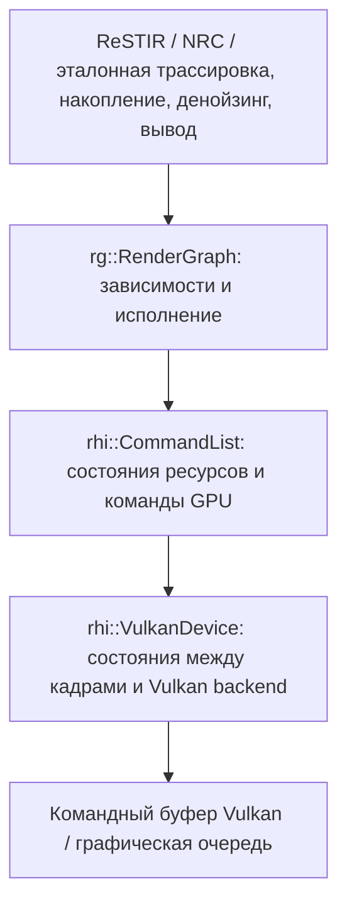
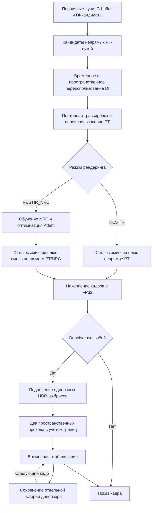

# VulkanLearn2

**Экспериментальный bindless-рендерер на Vulkan для ReSTIR: прямого и глобального освещения и трассировки путей.**

[English](README.md) | Русский

VulkanLearn2 — проект на C++20 для изучения ресэмплинга резервуаров и освещения при малом числе сэмплов. В нём есть эталонный трассировщик путей с next event estimation (NEE), конвейер ReSTIR DI + PT, светящиеся треугольники и экспериментальный Neural Radiance Cache (NRC). Текущие режимы рендеринга используют шейдеры Slang; в проекте также сохранены реализации на GLSL.

[Возможности](#возможности) · [Архитектура](#render-graph-rhi-и-vulkan) · [Сборка](#сборка) · [Запуск и настройка](#запуск-и-настройка) · [Управление](#управление) · [Порядок рендеринга](#порядок-рендеринга) · [Галерея](#галерея) · [Карта кода](#карта-кода)

## Галерея

**[Как рендерер выглядит в динамике — видео на YouTube](https://www.youtube.com/watch?v=Q_fKG3UT02U)**

Пятнадцать снимков текущего рендерера **ReSTIR DI + PT**, без NRC: **1200 × 800**, кадр **512**, четыре сцены и пять ракурсов. Первый столбец показывает один кадр без усреднения после прогрева резервуаров; в остальных усреднены **512 кадров**, а в последнем дополнительно включён денойзер.

**Сцена 1 — Sponza**

| Без накопления кадров | Накопление кадров | Накопление кадров + денойзер |
| --- | --- | --- |
|  |  |  |

**Сцена 2 — Lost Empire, Ракурс 1**

| Без накопления кадров | Накопление кадров | Накопление кадров + денойзер |
| --- | --- | --- |
|  |  |  |

**Сцена 2 — Lost Empire, Ракурс 2**

| Без накопления кадров | Накопление кадров | Накопление кадров + денойзер |
| --- | --- | --- |
|  |  |  |

**Сцена 3 — Subway**

| Без накопления кадров | Накопление кадров | Накопление кадров + денойзер |
| --- | --- | --- |
|  |  |  |

**Сцена 5 — Bistro Interior**

| Без накопления кадров | Накопление кадров | Накопление кадров + денойзер |
| --- | --- | --- |
|  |  |  |

<details>
<summary>Условия съёмки и воспроизведение</summary>

Все пятнадцать изображений получены в **`RESTIR`**, **1200 × 800**, на кадре **512**, с камерой, записанной для каждого ракурса в манифесте, seed субпиксельного сдвига **0** и пределом непрямых отражений **3**. Первый столбец показывает кадр 512 с уже работающим переиспользованием резервуаров, без усреднения RGB предыдущих кадров. В остальных столбцах накопление включено на 512 кадров; в последнем также включён денойзер. Каждый кадр начинается с восьми PT-кандидатов на пиксель с пересечением, поэтому эти снимки не обозначены как «1 spp». Для всех изображений применена одинаковая кривая отображения без индивидуальной подстройки экспозиции.

Во всех четырёх сценах заданы `environmentIntensity=1` и `indirectSunScale=1`. В Subway направленное солнце выключено через `useSun=0`; Sponza, Lost Empire и Bistro используют солнце из своей конфигурации. Цвета создаваемых точечных источников Lost Empire также используют seed **0**.

Для съёмки с текущими настройками сцен в XML под новым именем ракурса после сборки Release и установки ресурсов четырёх сцен выполните из корня репозитория:

```powershell
python -m pip install numpy pillow
python img/restir-pt/capture.py --view my-view
```

[Скрипт съёмки](img/restir-pt/capture.py) по умолчанию выбирает сцены **1, 2, 3 и 5** и все три режима. Он создаёт отдельные конфигурации и HDR-диагностику в `win64/readme-gallery`, сохраняя исходный `assets/config.xml`. [Манифест снимков](img/restir-pt/captures.json) содержит камеру каждого ракурса, переключатели, число кадров и хеши файлов. Чтобы воспроизвести сохранённый ракурс, сначала задайте в XML его атрибуты камеры из манифеста: скрипт использует текущую конфигурацию и не восстанавливает прежние камеры автоматически.

Существующие имена файлов с другими настройками сцены или камеры защищены: выберите новое имя `--view`, чтобы сохранить прежние снимки. Ракурс 2 Lost Empire использует позицию `(2.742, 24.369, 1.084)`, pitch `-0.237` и yaw `-6.489`. Настроив эту камеру, сохраните три режима под отдельными именами файлов:

```powershell
python img/restir-pt/capture.py --scenes 2 --view view-2
```

</details>

## Возможности

### Рендеринг и освещение

- **ReSTIR DI:** 64 кандидата света обрабатываются в восьми RIS-группах, затем выбираются с учётом видимости. Временное и пространственное переиспользование используют ту же целевую функцию с проверкой видимости для прямого освещения.
- **ReSTIR PT:** восемь начальных кандидатов непрямого пути на пиксель, временное переиспользование при неподвижной камере и пространственное переиспользование. Пути трассируются заново по сохранённому seed генератора случайных чисел: на принимающей поверхности пересчитываются BRDF, освещение и видимость с учётом субпиксельного сдвига лучей камеры. Рабочий режим `RESTIR` объединяет DI и PT.
- **Эталонный path tracer:** NEE с выбором источников через RIS, сэмплирование диффузной и зеркальной составляющих BRDF, светящиеся поверхности, теневые лучи и завершение путей методом русской рулетки.
- **Сэмплирование множества источников:** направленный солнечный свет, точечные источники и светящиеся треугольники с текстурами. ReSTIR выбирает свет через локальные alias-таблицы с весами по световому потоку в пространственной сетке `32³`. DI использует 64 RIS-кандидата, непрямой PT — одного NEE-кандидата на отражение. Для светящихся треугольников сохранены исходная модель точечного источника со сглаженным затуханием и принятые в проекте параметры освещения сцен.
- **PBR-материалы:** базовый цвет, металличность, шероховатость, карты нормалей, эмиссия и обработка прозрачности в any-hit шейдерах. Общий код BRDF по умолчанию использует микрофасеточную модель GGX для зеркальной составляющей и Frostbite diffuse для диффузной.
- **Загрузка сцен:** импорт через Assimp, с конфигурациями сцен OBJ, glTF и FBX; преобразования сцены, положение камеры и освещение задаются через XML.
- **Интерактивная настройка:** камера на SDL2, интерфейс Dear ImGui для глубины непрямых путей и солнечного света, окно статистики и лога со временем кадра на CPU. Временные метки кадра и денойзера на GPU считываются после существующего ожидания frame fence; диагностика сохраняет их в `gpu-times.csv`.

### Render graph, RHI и Vulkan

Существовавший, но ранее не использовавшийся render graph переработан и теперь исполняет рабочий конвейер рендеринга. Каждый кадр проходы объявляют импортированные изображения/буферы и требуемый доступ, затем записывают реальные команды трассировки, вычислений, копирования и рисования через RHI (Rendering Hardware Interface).



[Граф](src/vk_render_graph.h) и [контракты RHI](src/rhi/rhi.h) не содержат типов Vulkan. Граф строит стабильный порядок зависимостей при чтении после записи, записи после чтения и записи после записи, поддерживает явные зависимости и обнаруживает циклы и чтение неинициализированных ресурсов. Импорт одного физического ресурса под разными именами даёт общий handle и общую историю зависимостей.

Реальные узлы кадра: `ReSTIR.DI.Init`, `ReSTIR.PT.Init`, проходы переиспользования DI, `ReSTIR.PT.PrepareTemporal` и `ReSTIR.PT.ReplayAndSpatial`; затем `ReSTIR.Shade` либо `NRC.Train` → `NRC.Optimize` → `NRC.Inference`. За `Accumulation.Mean` и `Accumulation.StoreHistory` следуют опциональные `Denoiser.Prefilter`, `Denoiser.Spatial0/1` и `Denoiser.Temporal`, затем `Display.TonemapAndImGui` и `Display.Present`. См. [объявления проходов](src/graphic_pipeline/vk_gi_raytrace_graphics_pipeline.cpp) и [цикл кадра](src/vk_engine.cpp).

[Vulkan backend](src/rhi/vulkan_rhi.cpp) переводит объявленные состояния в барьеры изображений/буферов и сохраняет состояния ресурсов между кадрами. Пересоздание графа не очищает историю резервуаров, накопления или денойзера: её пригодностью по-прежнему управляют настройки рендеринга и изменения камеры. Исполнение идёт в одной графической очереди, без асинхронного планирования и переиспользования одной области временной памяти разными ресурсами.

Независимый [ResourceDevice](src/rhi/resource.h) также создаёт изображения/буферы, обновляет буферы и освобождает ресурсы. Накопление и денойзинг используют его для своих изображений и покадровых uniform-буферов через [Vulkan/VMA backend](src/rhi/vulkan_resources.cpp). Vulkan пока единственный backend. Инициализация движка, загрузка ресурсов сцены, выделение GI/NRC-ресурсов, дескрипторы и создание конвейеров ещё используют Vulkan напрямую; существующая настройка дескрипторов/framebuffers получает нативные ресурсы через явные методы backend.

Откройте **Edit GI → Render graph** в ImGui, чтобы увидеть порядок записанных проходов. Перед запуском задайте `$env:RESTIR_GRAPH_DUMP = "frame-graph.dot"`, чтобы сохранить скомпилированный граф первого кадра в DOT-файл относительно рабочего каталога процесса. Порядок проходов также выводится в лог при запуске.

#### Возможности Vulkan

Рендерер использует **bindless-доступ к ресурсам сцены**: текстуры и буферы вершин/индексов отдельных мешей находятся в массивах дескрипторов, общих для проходов рендеринга. Шейдеры выбирают геометрию и текстуры по индексам мешей и материалов, без перепривязки дескрипторов для каждого объекта или материала. Общий набор дескрипторов сцены также предоставляет материалы, источники света, структуру ускорения верхнего уровня и резервуары ReSTIR.

В текущих проходах трассировки и вычислений используются:

| Возможность Vulkan / техника | Применение в рендерере |
| --- | --- |
| **Descriptor indexing / bindless-ресурсы** | `VK_EXT_descriptor_indexing`: массивы ресурсов с размером, задаваемым во время выполнения, и неоднородной индексацией (`NonUniformResourceIndex`), а также флаги partially bound и update-after-bind для привязок дескрипторов. См. [дескрипторы сцены](src/vk_resource_manager.cpp), [layouts дескрипторов](src/vk_descriptors.cpp) и [доступ к материалам и геометрии](shaders_slang/indirect_raytrace_gbuffer.rchit.slang). |
| **Аппаратная трассировка лучей** | `VK_KHR_acceleration_structure` и `VK_KHR_ray_tracing_pipeline`: BLAS для мешей, TLAS с экземплярами объектов сцены, shader binding tables, шейдеры ray generation, closest-hit, any-hit и miss для path tracing и ReSTIR. См. [настройку трассировки](src/vk_raytracer_builder.cpp). |
| **Inline ray queries** | `VK_KHR_ray_query` проверяет тени и видимость внутри вычислительных шейдеров, включая проверку непрозрачности через bindless-текстуры материалов. Шейдинг ReSTIR и инференс NRC используют общую [реализацию видимости](shaders_slang/restir_visibility.h). |
| **Buffer device address** | Адреса GPU используются для геометрии и временных буферов при построении структур ускорения, shader binding tables и преобразования матриц cooperative vectors. См. [буферы трассировки](src/vk_raytracer_builder.cpp) и [преобразование матриц](src/neural_shading/CoopVector.cpp). |
| **Compute shaders и cooperative vectors** | Вычислительные проходы выполняют переиспользование резервуаров, расчёт освещения, обучение и инференс NRC. `RESTIR_NRC` использует `VK_NV_cooperative_vector`, веса и векторные операции в FP16, накопление градиентов в FP32 и преобразование между форматами размещения матриц. См. [шейдеры NRC](shaders_slang/nrc_training_mlp.h) и [neural shading](src/neural_shading/). |
| **Явное управление памятью и синхронизацией** | Выделение памяти через VMA, загрузка через staging-буферы, storage buffers/images, переходы layouts изображений и pipeline barriers согласуют копирование, трассировку, вычисления и графические проходы. Цикл кадра использует fences и бинарные семафоры с двумя кадрами в обработке; накопление хранит HDR-историю в FP32. См. [цикл кадра](src/vk_engine.cpp) и [проход накопления](src/graphic_pipeline/vk_simple_accumulation_graphics_pipeline.cpp). |
| **SPIR-V reflection и специализация шейдеров** | Slang и GLSL компилируются в SPIR-V. SPIRV-Reflect определяет layouts дескрипторов и диапазоны push constants; модули шейдеров и layouts дескрипторов кешируются. Константа специализации выбирает кодирование цвета под формат swapchain. См. [инфраструктуру шейдеров](src/vk_shaders.cpp) и [финальный шейдинг](src/graphic_pipeline/vk_gbuffer_shading_graphics_pipeline.cpp). |

В ранее реализованных и опциональных проходах также сохранены следующие техники Vulkan:

| Техника | Реализация и текущее состояние |
| --- | --- |
| **Mesh/task shaders и meshlets** | Конвейеры `VK_NV_mesh_shader` реализуют растеризацию meshlets, генерацию G-buffer и visibility buffer. Meshlets строятся через meshoptimizer. Эти растровые проходы и вызов предварительной обработки meshlets отключены в текущей конфигурации. См. [обработку мешей](src/vk_mesh.cpp) и [растровые шейдеры](shaders/). |
| **Отсечение на GPU и indirect multi-draw** | Compute/task шейдеры реализуют отсечение по пирамиде видимости (frustum culling) и иерархической глубине (Hi-Z occlusion culling). Команды, сформированные compute-шейдером, передают несколько mesh-task draws через `vkCmdDrawMeshTasksIndirectNV`; также есть обёртка indexed indirect draw. Вызовы отсечения, рисования и построения пирамиды глубины в старом цикле рендеринга отключены. См. [генерацию команд](shaders/drawcmd.comp), [task-шейдер](shaders/tri_mesh.task) и [обёртки рисования](src/vk_command_buffer.cpp). |
| **Push descriptors** | `VK_KHR_push_descriptor` передаёт ресурсы вычислительным проходам NRD. Реализация сохранена в [интеграции денойзера](src/graphic_pipeline/vk_raytracer_denoiser_pass.cpp), инициализация и запуск которой сейчас отключены. |
| **Валидация и временные метки GPU** | Опциональная отладочная настройка включает Vulkan validation, проверку синхронизации, GPU-assisted validation и отладочные сообщения. Время кадра и денойзера на GPU считывается после существующего ожидания fence; диагностика сохраняет `gpu-times.csv`. См. [настройку устройства и кадра](src/vk_engine.cpp) и [переключатели возможностей](src/vk_types.h). |

При создании устройства по-прежнему запрашиваются некоторые расширения отключённых проходов, включая `VK_NV_mesh_shader` и `VK_KHR_push_descriptor`; связанные ограничения оборудования описаны в [требованиях к сборке](#требования).

### Состояние компонентов

Часть компонентов находится в экспериментальном состоянии, другие пока отключены в текущем цикле рендеринга:

| Компонент | Текущее состояние |
| --- | --- |
| Neural Radiance Cache | `RESTIR_NRC` обучается на непрямом освещении PT с cooperative vectors в Slang, явным обратным распространением, накоплением градиентов в FP32 и оптимизатором Adam. Скрытые слои начинают со случайных весов, выходной — с нулевых. Итог объединяет прямое освещение ReSTIR, видимую эмиссию и смесь непрямого освещения PT/NRC. Шаги 1–32 используют PT; на шагах 33–128 вклад кеша увеличивается до 25%, сохраняя минимум 75% PT, чтобы недообученный кеш не заменял всё непрямое освещение. При NaN/Inf в предсказании используется PT. |
| Отдельные проходы ReSTIR GI | Реализованы временное и пространственное переиспользование GI; их вызовы отключены в рабочем конвейере DI + PT. |
| Временной и пространственный денойзер | Доступен в `RESTIR` и `RESTIR_NRC`, по умолчанию выключен. После накопления в FP32 предварительный фильтр подавляет одиночные HDR-выбросы с учётом геометрии и материалов, выполняются два прохода à-trous с шагами `1` и `2` пикселя, затем временная репроекция стабилизирует показываемый результат. Отдельная история денойзера используется только временным проходом. |
| NVIDIA NRD | Есть отдельная интеграция и сборка HLSL-шейдеров. Инициализация и запуск NRD остаются закомментированными; переключатель **Denoiser** управляет фильтром выше. |
| Накопление кадров | Включено по умолчанию; переключатель **Frame accumulation** в интерфейсе или запуск с `RESTIR_ACCUMULATION=0` позволяют смотреть кадры без усреднения. Линейная HDR-яркость усредняется в FP32 с чтением точного пикселя. Изменения камеры, солнца или глубины путей сбрасывают историю; NaN/Inf в сэмплах не портят последующие кадры. Исходная кривая отображения применяется после усреднения. |
| Растеризация G-buffer / visibility buffer | Есть конвейеры с mesh/task шейдерами, обработка meshlet и код отсечения с пирамидой глубины. `GBUFFER_ON` и `VBUFFER_ON` по умолчанию равны `0`. |
| HDR / image-based lighting | В `RESTIR` и `RESTIR_NRC` можно включить эквидистантную HDR-карту окружения в FP32 через bindless-текстуры. Первичные промахи показывают окружение; уходящие из сцены BRDF-лучи учитывают его освещение. Прежний генератор environment/irradiance/prefiltered cubemap остаётся отключённым. |
| Streamline | Есть SDK и код обёртки; `STREAMLINE_ON` по умолчанию равен `0`. DLSS не включён в рабочий рендеринг. |

Это исследовательский и учебный проект. Галерея начинается с воспроизводимых снимков текущего рендерера и сохраняет старые эксперименты ниже. Результаты зависят от сцены, настроек и оборудования.

## Сборка

### Требования

Текущая сборка рассчитана на **Windows x64**. Она использует включённые в репозиторий Windows-библиотеки SDL2, import-библиотеку Streamline, Win32-определения Vulkan и `.exe`-компиляторы шейдеров.

- **Visual Studio 2022** с компонентами разработки классических приложений на C++ и Windows SDK, включая FXC для стандартной сборки шейдеров NRD.
- **CMake** с генератором `Visual Studio 17 2022` — версия 3.21 или новее.
- **Vulkan SDK** с заголовками Vulkan 1.4, `glslc.exe`, `slangc.exe` и `dxc.exe` с поддержкой SPIR-V. Slang должен поддерживать `spvCooperativeVectorNV`. Существующая локальная конфигурация сборки использует SDK **1.4.309.0**; это ориентир по конфигурации, а не проверенная минимальная версия.
- **Совместимые видеокарта NVIDIA и драйвер.** Создание устройства требует Vulkan 1.4 и NVIDIA-расширений для mesh shaders и cooperative vectors. Одной поддержки трассировки лучей недостаточно.

Требования к устройству в [vk_engine.cpp](src/vk_engine.cpp) включают `VK_KHR_ray_tracing_pipeline`, `VK_KHR_acceleration_structure`, `VK_KHR_ray_query`, `VK_NV_mesh_shader`, `VK_NV_cooperative_vector` и `VK_EXT_shader_replicated_composites`, а также descriptor indexing и buffer device addresses. **Поддержка cooperative vectors запрашивается во всех режимах**, включая `PATHTRACER` и `RESTIR`; `RESTIR_NRC` дополнительно требует обучения cooperative vectors с накоплением в FP32.

Зависимости находятся в `third_party/`: SDL2, GLM, volk, vk-bootstrap, VMA, Assimp, Dear ImGui, meshoptimizer, SPIRV-Reflect, NRD и Streamline. Сохраняйте эти каталоги при клонировании или копировании проекта.

### Конфигурация и компиляция

Выполните команды в PowerShell. Если установщик не настроил `VULKAN_SDK`, задайте в этой переменной каталог установленного SDK. Явные пути к компиляторам позволяют не зависеть от путей поиска в CMake; скорректируйте их, если структура вашего SDK отличается.

```powershell
git clone https://github.com/collateraris/VulkanLearn2.git
Set-Location VulkanLearn2

cmake -S . -B build -G "Visual Studio 17 2022" -A x64 `
  "-DGLSLC:FILEPATH=$env:VULKAN_SDK/Bin/glslc.exe" `
  "-DSLANG:FILEPATH=$env:VULKAN_SDK/Bin/slangc.exe" `
  "-DDXC:FILEPATH=$env:VULKAN_SDK/Bin/dxc.exe" `
  -DASSIMP_BUILD_ZLIB=ON

cmake --build build --config Release --target vulkan_guide --parallel
```

Исполняемая цель называется **`vulkan_guide`**. С этим генератором программа собирается в `bin/Release/vulkan_guide.exe`. Если существующий кеш в `build/` создан другим генератором, используйте новый каталог сборки.

Исполняемая цель зависит от `Shaders`, которая компилирует GLSL, Slang и HLSL-шейдеры NRD в SPIR-V рядом с исходниками. Правила GLSL и Slang учитывают общие заголовки шейдеров и модули Slang: их изменение автоматически запускает перекомпиляцию. NRD дополнительно собирает собственные контейнеры шейдеров, поэтому первая сборка включает значительный объём компиляции шейдеров.

### Тесты render graph

`RESTIR_BUILD_TESTS` по умолчанию включён (`ON`). [Отдельные тесты](tests/render_graph_tests.cpp) используют имитацию командного списка и не требуют GPU при запуске. Они проверяют порядок зависимостей, псевдонимы ресурсов, инициализацию, циклы, сброс/повторную компиляцию и исполнение команд. Для сборки, настроенной в `win64`, выполните команды ниже; если использовали конфигурацию выше, замените `win64` на `build`.

```powershell
cmake --build win64 --config Release --target render_graph_tests
ctest --test-dir win64 -C Release --output-on-failure
```

### Библиотеки для запуска

CMake автоматически копирует SDL2, Streamline interposer и динамические библиотеки Assimp/NRD рядом с `vulkan_guide.exe` после линковки. Пути к библиотекам выбираются по конфигурации сборки: Release получает `assimp-vc143-mt.dll` и `NRD.dll`, а Debug — `assimp-vc143-mtd.dll` и `NRDd.dll` с текущим набором инструментов MSVC.

При переносе сборки сохраняйте эти DLL рядом с программой. Если файлы удалены из существующего каталога вывода, выполните пересборку цели `vulkan_guide`, чтобы восстановить их. CMake продолжает линковать NRD и import-библиотеку Streamline, хотя их интеграции в рендеринг отключены.

## Запуск и настройка

### Первый запуск

Перед запуском откройте [assets/config.xml](assets/config.xml). Для старта с включённой в репозиторий сценой Sponza замените существующие элементы `current_scene` и `render_mode` на:

```xml
<current_scene id="1"></current_scene>
<render_mode name="RESTIR"></render_mode>
```

Затем запустите программу **с рабочим каталогом `bin/Release`**:

```powershell
Set-Location .\bin\Release
.\vulkan_guide.exe
```

Пути `../../assets/`, `../../shaders/` и `../../shaders_slang/` разрешаются относительно **рабочего каталога процесса**, а не расположения исполняемого файла. Для отладчика Visual Studio рабочим каталогом назначена папка программы. При запуске из корня репозитория эти пути будут разрешаться неправильно.

### Режимы рендеринга

| `render_mode name` | Поведение |
| --- | --- |
| `RESTIR` | ReSTIR DI + PT с временным и пространственным переиспользованием и последующим расчётом освещения по резервуарам. |
| `PATHTRACER` | Эталонная трассировка путей с NEE и выбором источников света через RIS. |
| `RESTIR_NRC` | Прямое освещение ReSTIR и видимая эмиссия объединяются с непрямым освещением PT/NRC, затем при необходимости применяется накопление кадров. После прогрева сохраняется минимум 75% PT и используется до 25% NRC. PT-резервуары также дают обучающие значения. |

Режим и сцена читаются при старте. После изменения XML перезапустите приложение. Аргументы командной строки для выбора сцены или режима не реализованы.

### Предустановки сцен

| Индекс | Путь к модели относительно `assets/` | Наличие ресурсов |
| --- | --- | --- |
| `0` | `builder/scene.gltf` | Включена: офисное здание Atlanta. |
| `1` | `sponza.obj` | Включена: Sponza. |
| `2` | `lost_empire.obj` | Включена: Lost Empire. |
| `3` | `r46_subway/scene.gltf` | Внешняя сцена; не отслеживается в репозитории. |
| `4` | `Bistro_v5_2/BistroExterior.fbx` | Внешняя сцена; не отслеживается в репозитории. |
| `5` | `Bistro_v5_2/BistroInterior.fbx` | Внешняя сцена; не отслеживается в репозитории. |

Загрузчик трактует `current_scene.id` как **позицию с нуля** в списке `<scene_configs>`, а не ищет сцену по атрибуту `id`. При добавлении сцен сохраняйте соответствие порядка и индексов. Для внешних сцен нужны файлы моделей и связанные текстуры по указанным путям.

XML также задаёт название и разрешение окна, масштаб и поворот сцены, солнечный свет, необязательную равномерную сетку точечных источников, начальную позицию и ориентацию камеры. Несмотря на имя атрибута, `radians` для модели преобразуется загрузчиком из градусов; `camPitch` и `camYaw` используются непосредственно как радианы. Путь `hdr` сцены задаёт текстуру окружения; размеры cubemap относятся к прежнему отключённому IBL-генератору.

Два необязательных атрибута `<scene>` задают параметры освещения в `RESTIR` и `RESTIR_NRC`:

| Атрибут | По умолчанию | Действие |
| --- | --- | --- |
| `environmentIntensity` | `0` | Множитель HDR-окружения; `0` отключает его загрузку и сэмплирование. |
| `indirectSunScale` | `0.015625` (`1/64`) | Множитель солнечного света на вторичных пересечениях; первичное освещение солнцем не меняется. |

Все шесть конфигураций сцен (`0`–`5`) явно задают оба атрибута равными `1`: каждая использует свой HDR и полный вклад солнечного света на вторичных пересечениях. `useSun` по-прежнему управляет наличием солнца; в Subway оно остаётся выключенным. Значения по умолчанию из таблицы применяются при отсутствии атрибута. Оба значения должны быть конечными и неотрицательными. Видимость окружения определяется трассировкой лучей; отдельного importance sampling или NEE для окружения нет, поэтому небольшие яркие области HDR-карты могут оставаться шумными.

## Управление

При запуске управление камерой включено. Нажмите **`M`**, чтобы приостановить ввод камеры и работать с интерфейсом; повторное нажатие вернёт управление камерой.

| Ввод | Действие |
| --- | --- |
| Мышь | Осмотр при активном управлении камерой. |
| `W` / `S` или стрелки вверх / вниз | Движение вперёд / назад. |
| `A` / `D` или стрелки влево / вправо | Движение влево / вправо. |
| `R` / `F` | Движение вверх / вниз. |
| Левый Shift | Ускорение при удержании. |
| `Q` / `E` | Поворот по горизонтали. |
| `Z` / `X` | Поворот по вертикали. |
| `M` | Переключение ввода камеры для работы с UI. |
| Закрытие окна / Alt+F4 | Выход. |

В панели **Edit GI** параметр `Indirect numRays` задаёт предел непрямых отражений, а не число сэмплов на пиксель. Начальное значение в UI — `3`; значение `0` отключает непрямое освещение, включая предсказание NRC. Здесь же можно менять положение и поворот камеры, а при включённом для сцены солнце — его направление и цвет. Такие изменения сбрасывают накопление кадров и историю резервуаров; изменения освещения или глубины также перезапускают историю оптимизатора и прогрев NRC.

Включите **Edit GI → Denoiser** в ImGui, чтобы уменьшить видимый шум в `RESTIR` или `RESTIR_NRC`. По умолчанию он выключен и работает как с включённым, так и с выключенным **Frame accumulation**. Предварительный фильтр определяет одиночные HDR-выбросы по соседям на совместимой поверхности и меняет RGB одним множителем. Два пространственных прохода сглаживают изображение с учётом геометрии и материалов; затем временная репроекция стабилизирует результат и отклоняет историю от несовместимых и вновь открывшихся поверхностей. Фон, видимые источники света и зеркала защищены; глянцевые поверхности фильтруются слабее.

Денойзер хранит итоговое стабилизированное изображение отдельно от линейного накопления и данных обучения NRC. Предварительный фильтр расширяет окно с `3×3` до `5×5` возле подозрительных ярких сэмплов, чтобы подавлять небольшие группы выбросов. Пространственные проходы каждый кадр получают результат текущего предварительного фильтра; история используется только для временной стабилизации, что предотвращает повторное пространственное размытие. Она сбрасывается при переключении денойзера, изменении освещения или настроек рендеринга и резких сменах камеры. Исходное линейное накопление, резервуары ReSTIR и данные обучения NRC сохраняются. Подавление выбросов вносит смещение в оценку яркости и может ослабить настоящие одиночные блики; мелкие детали могут сглаживаться, а глянцевые отражения остаются сложным случаем для шумоподавления.

## Порядок рендеринга

Рабочая реализация объединяет отдельные резервуары прямого освещения (**DI**) и непрямых путей (**PT**). [GI-конвейер](src/graphic_pipeline/vk_gi_raytrace_graphics_pipeline.cpp) запускает следующие проходы:



1. **Первое пересечение и кандидаты света.** [Инициализация DI](shaders_slang/restir_di_start.rgen.slang) трассирует первичный луч с субпиксельным сдвигом и записывает позицию/ID объекта, нормали, альбедо/металличность и эмиссию/шероховатость. Локальная сетка `32³` предоставляет alias-таблицы с весами по световому потоку. Из 64 кандидатов света формируются восемь групповых резервуаров; их представители проходят повторный отбор с проверкой видимости в целевой функции.

2. **Кандидаты непрямых путей.** [Инициализация PT](shaders_slang/restir_start.rgen.slang) создаёт восемь независимых seed на пиксель с пересечением. [Общая трассировка пути](shaders_slang/restir_pathtrace.h) выбирает диффузные/зеркальные BRDF-направления, учитывает их вероятности в весе пути, добавляет эмиссию вторичных пересечений и проверяет видимость одного кандидата света на отражение. Уходящие из сцены лучи сэмплируют HDR-окружение, если оно включено. Предел непрямых отражений по умолчанию — `3`.

3. **Отбор взвешенного представителя.** [PT-резервуар](shaders_slang/gi_pathtrace.h) хранит один seed и его радианс, число представленных сэмплов `M`, сумму весов отбора и итоговый вес `W`. [Целевая функция и нормировка](shaders_slang/restir_lighting.h): `t = max(1e-8, luminance(L))`, `W = weightSum / (M × t_selected)`. Вес при объединении — `t_receiver × W_source × M_source`. Малый порог целевой функции сохраняет возможность отбора тёмных сэмплов, не добавляя свет в изображение.

4. **Повторная трассировка полезных seed.** [Переиспользование PT](shaders_slang/restirPTSpacial.rgen.slang) сначала трассирует предыдущий seed от текущей поверхности, ограничивая его число представленных сэмплов десятикратным начальным числом. Временной резервуар сохраняется до пространственного прохода. До семи случайных попыток в окне `3×3` берут начальные резервуары соседей с проверками расстояния и нормали; соседи могут повторяться. Каждый принятый seed заново трассируется от принимающего пикселя с пересчётом BRDF, выбора света и видимости. Это тождественное отображение в пространстве первичных случайных чисел (`J = 1`), без переподключения вершин. Повторная трассировка учитывает и субпиксельные изменения пересечений при неподвижной камере. DI отдельно переиспользует резервуары во времени и пространстве в пределах одной ячейки световой сетки.

5. **Сборка результата и показ.** [Финальный шейдинг](shaders_slang/restirShade.comp.slang) складывает видимую эмиссию, взвешенное DI и `L_PT × W_PT`; в `RESTIR_NRC` непрямая часть заменяется смесью PT/NRC. Изменения камеры, освещения или предела отражений сбрасывают историю резервуаров. **Frame accumulation** независимо усредняет линейный RGB по кадрам; его отключение сохраняет переиспользование резервуаров. Опциональный денойзер имеет третью, отдельную историю и обрабатывает только показываемый результат.

**Совместимость освещения:** прямое освещение и эмиссия поверхностей используют произведение текстуры эмиссии и `emissiveFactor`. Исходное применение `emissiveStrength` сохранено при оценке светового потока/радиуса источника и в непрямом NEE. Для непрямого освещения от точечных заменителей светящихся треугольников явно задан коэффициент мощности `1/64`, отдельно от числа кандидатов и нормировки резервуаров. Свет окружения добавляется отдельно; направленный солнечный свет использует `indirectSunScale` вместо коэффициента точечных источников.

### Сравнение с оригинальным ReSTIR PT

Под оригиналом здесь понимаются [работа Lin и соавторов, SIGGRAPH 2022](https://research.nvidia.com/labs/rtr/publication/lin2022generalized/) и реализация её авторов. GRIS описывает переиспользование коррелированных сэмплов и условия сходимости; этот рендерер реализует меньший набор практических механизмов.

| Аспект | Оригинальный алгоритм / реализация авторов | Этот проект |
| --- | --- | --- |
| Перенос пути | Переподключение вершин, random replay и гибридное отображение. Гибрид заново строит префикс пути и подключает его к сохранённой вершине с соответствующим якобианом. [Реализация отображений](https://github.com/DQLin/ReSTIR_PT/blob/master/Source/RenderPasses/ReSTIRPTPass/Shift.slang). | Только полная повторная трассировка seed с `J = 1` в пространстве первичных случайных чисел. Random replay уже есть в оригинале; переподключение вершин и гибридное отображение здесь отсутствуют. |
| Веса переиспользования | Обобщённый resampling MIS учитывает соотношения распределений и отображений; дополнение описывает парные и защитные конструкции весов. [Дополнение, §S1](https://graphics.cs.utah.edu/research/projects/gris/GRIS_supplemental.pdf). | Яркостная целевая функция, вес источника `W × M`, ограничение числа сэмплов и отбор соседей. Полный набор MIS-механизмов оригинала не реализован; несмещённость и сходимость этих решений не установлены. |
| Движение камеры | Векторы движения находят предыдущую поверхность; используются прошлые данные видимости и обновления динамической сцены. [Временное переиспользование](https://github.com/DQLin/ReSTIR_PT/blob/master/Source/RenderPasses/ReSTIRPTPass/TemporalReuse.cs.slang). | Временное переиспользование резервуаров требует неподвижной камеры; движение сбрасывает историю. Репроекция денойзера относится к отдельной фильтрации изображения. |
| Дополнения рендерера | ReSTIR PT решает задачу переиспользования многократного переноса света. [Статья](https://research.nvidia.com/labs/rtr/publication/lin2022generalized/). | Отдельные DI-резервуары, локальная модель сглаженных точечных источников, смесь с NRC, усреднение кадров и собственный денойзер образуют конвейер этого проекта. |

Резервуары хранят компактное состояние seed, но каждое принятое переиспользование по-прежнему требует повторной трассировки. Восемь начальных кандидатов и повторные пути дают нагрузку больше одного пути на пиксель. [Галерея](#галерея) сравнивает настройки этого проекта; это не сравнительный бенчмарк с рендерером авторов статьи.

## HDR-диагностика накопления

Для проверки яркости и сходимости рендерер может сохранять линейное HDR-изображение в FP32 на заданных кадрах и автоматически завершать работу. По умолчанию сохраняется выбранный для показа результат до тонального отображения, включая шумоподавление, если оно включено. Запуск из `bin/Release` или `bin/Debug`:

```powershell
$env:RESTIR_DIAGNOSTICS_FRAMES = '1,32,128,512,2048'
$env:RESTIR_DIAGNOSTICS_MAX_FRAMES = '2048'
$env:RESTIR_DIAGNOSTICS_OUTPUT = [IO.Path]::GetFullPath('..\..\win64\runtime\restir')
.\vulkan_guide.exe
Remove-Item Env:RESTIR_DIAGNOSTICS_FRAMES, Env:RESTIR_DIAGNOSTICS_MAX_FRAMES, Env:RESTIR_DIAGNOSTICS_OUTPUT
```

Задайте `$env:RESTIR_ACCUMULATION = '0'` перед запуском, чтобы сохранять отдельные кадры с работающим переиспользованием резервуаров ReSTIR; удалите переменную для возврата к настройке по умолчанию. Кадр `1` всегда неусреднённый, даже при включённом накоплении.

Переменная `$env:RESTIR_DENOISER = '1'` включает денойзер при запуске. В режиме диагностики `RESTIR_DIAGNOSTICS_RAW=1` сохраняет историю накопления без шумоподавления независимо от состояния денойзера; вместе с `RESTIR_ACCUMULATION=0` она позволяет получить отдельные нефильтрованные кадры. Для автоматической проверки переключения `RESTIR_DIAGNOSTICS_DENOISER_TOGGLE_FRAMES=16,32` меняет состояние денойзера перед рендерингом кадров `16` и `32`. После сравнения удалите эти переменные окружения для возврата к настройкам по умолчанию.

Для проверки истории при движении `RESTIR_DIAGNOSTICS_CAMERA_MOTION=1` перемещает и поворачивает камеру на кадрах `65`–`128`, затем останавливает её; дополнительная переменная `RESTIR_DIAGNOSTICS_CAMERA_CUT=1` задаёт резкий поворот на кадре `192`. Диагностические запуски используют скрытое окно и сохраняют `gpu-times.csv` со временем кадра и денойзера на GPU. Замеры считываются после существующего ожидания fence кадра, без дополнительного ожидания ради таймингов.

В каталоге появятся линейные RGB-снимки `.pfm` до тонального отображения и `frames.csv`: средние RGB и яркость, диапазон и стандартное отклонение яркости, число пикселей с NaN/Inf и чёрных пикселей. Сравнивайте поздние кадры при неподвижной камере и неизменном освещении; прогрев NRC может менять яркость до стабилизации обучения. Сохранение ждёт завершения работы GPU, поэтому этот режим не подходит для измерения производительности. Нумерация кадров начинается с `1`; без `MAX_FRAMES` программа завершается после последнего снимка, а при заданном только `MAX_FRAMES` работает без чтения изображений. Для повторяемости снимков диагностика блокирует ввод камеры и задаёт seed `0` как для субпиксельных сдвигов камеры, так и для случайных цветов создаваемых точечных источников. Если обе переменные кадров не заданы, диагностика отключена.

## Архив


*Архивный скриншот, обозначенный в исходном README как 1 сэмпл на пиксель (spp) без накопления кадров. Текущее число кандидатов и переиспользование резервуаров описаны в разделе [Порядок рендеринга](#порядок-рендеринга).*

### Архивное сравнение эталонного path tracer и ReSTIR PT

Архивные скриншоты интерьера Bistro сохраняют исходные подписи **1 spp без накопления кадров**, относящиеся к старой реализации. В исходном README эталонный рендерер описан как основанный на *Ray Tracing Gems II*, с добавленной поддержкой светящихся треугольников и NEE RIS.

| Эталонный path tracer с NEE | ReSTIR PT |
| --- | --- |
|  |  |
|  |  |

<details>
<summary>Другие скриншоты ReSTIR PT</summary>


</details>

## Карта кода

| Путь | Назначение |
| --- | --- |
| [src/vk_engine.cpp](src/vk_engine.cpp) | Настройка Vulkan и устройства, инициализация сцены, цикл кадра и выбор режима. |
| [src/graphic_pipeline/](src/graphic_pipeline/) | Проходы ReSTIR, эталонной трассировки, NRC, денойзинга и вывода изображения. |
| [src/vk_render_graph.h](src/vk_render_graph.h), [src/vk_render_graph.cpp](src/vk_render_graph.cpp) | Независимый от backend граф кадра: зависимости ресурсов, проверки, исполнение и экспорт DOT. |
| [src/rhi/](src/rhi/) | Независимые интерфейсы ресурсов/команд, создание ресурсов накопления/денойзинга и Vulkan backend, сохраняющий состояния между кадрами. |
| [tests/render_graph_tests.cpp](tests/render_graph_tests.cpp) | Отдельные тесты графа с имитацией командного списка RHI. |
| [src/vk_light_manager.cpp](src/vk_light_manager.cpp) | Источники света, пространственная сетка и alias-таблицы. |
| [src/vk_assimp_loader.cpp](src/vk_assimp_loader.cpp) | Импорт моделей, материалов и текстур. |
| [src/neural_shading/](src/neural_shading/) | Структура сети NRC, параметры и утилиты cooperative vectors. |
| [shaders_slang/](shaders_slang/) | Рабочие DI/PT-шейдеры, BRDF, обучение/оптимизация/инференс NRC и вспомогательный код нейронного шейдинга. |
| [shaders/](shaders/) | GLSL-реализации, растеризация и mesh shaders, накопление и IBL. |
| [src/sys_config/](src/sys_config/) | Чтение XML и определения путей к ресурсам. |
| [assets/](assets/) | Конфигурация, включённые сцены, текстуры и сведения об авторах ресурсов. |
| [third_party/](third_party/) | Включённые библиотеки, интеграции SDK и бинарные компиляторы шейдеров. |
| [img/](img/) | Скриншоты проекта. |

## Решение проблем

- **CMake не находит компилятор шейдеров:** проверьте `VULKAN_SDK` и записи `GLSLC`, `SLANG`, `DXC` в кеше CMake. Версия `slangc.exe` без cooperative vectors не сможет собрать текущую цель шейдеров.
- **Ошибка настройки инструментов NRD:** проверьте наличие FXC/DXC в Windows SDK. Собственная конфигурация ShaderMake в NRD ищет эти инструменты отдельно от переменной `DXC` верхнего уровня.
- **При запуске не найдена DLL:** повторно запустите конфигурацию CMake и пересоберите `vulkan_guide` в нужной конфигурации. Шаг после сборки скопирует соответствующие библиотеки рядом с программой. Debug-библиотеки с суффиксом `d` не заменяют Release-версии.
- **Не загружаются конфигурация, модели или шейдеры:** проверьте рабочий каталог и выбранную сцену. Предустановки Subway и Bistro ссылаются на ресурсы, которых нет в свежем клоне.
- **Не найден подходящий GPU / ошибка создания устройства:** сравните возможности и расширения видеокарты с `init_vulkan()` в `src/vk_engine.cpp`. Выключение NRC в XML не снимает требование cooperative vectors.
- **Нет непрямого освещения:** увеличьте `Indirect numRays` выше `0`. Для освещения окружения в `RESTIR` или `RESTIR_NRC` задайте `environmentIntensity` сцены выше `0` и корректный путь `hdr`. Чёрный фон ожидаем при отключённом окружении.
- **Изменения шейдеров не применяются:** пересоберите `Shaders` и перезапустите приложение. Общие заголовки GLSL/Slang и модули Slang входят в зависимости сборки; после добавления новых файлов шейдеров повторно запустите CMake, а при изменении общих структур CPU/GPU пересоберите также приложение.

## Направление развития

Основными задачами остаются цели исходного README: улучшение модели шейдинга и ReSTIR, ускорение через NRC и развитие денойзинга. NRC уже участвует в итоговом изображении, но PT по-прежнему формирует обучающие значения каждый кадр. Дальнейшие задачи — улучшение качества кеша и снижение затрат на трассировку, временное переиспользование резервуаров при движении камеры, сохранение деталей отражений при шумоподавлении и уменьшение смещения оценки яркости при фильтрации выбросов.

## Благодарности

- В рендерере сохранены цель `vulkan_guide` и структура проекта на основе Vulkan Guide.
- Реализация BRDF содержит благодарность Якобу Бокшанскому за *Crash Course in BRDF Implementation*; атрибуция сохранена в [shaders_slang/brdf.h](shaders_slang/brdf.h).
- Sponza создана Франком Майнлем; см. [assets/README.md](assets/README.md).
- Lost Empire взята из Minecraft-мира Vokselia и преобразована в OBJ Морганом Макгуайром с помощью Mineways; см. [assets/copyright.txt](assets/copyright.txt).
- Офисное здание Atlanta создано 99.Miles и распространяется по CC BY 4.0; см. [assets/builder/license.txt](assets/builder/license.txt).
- Лицензии включённых зависимостей сохранены в `third_party/`. Для внешних сцен действуют условия их авторов.
